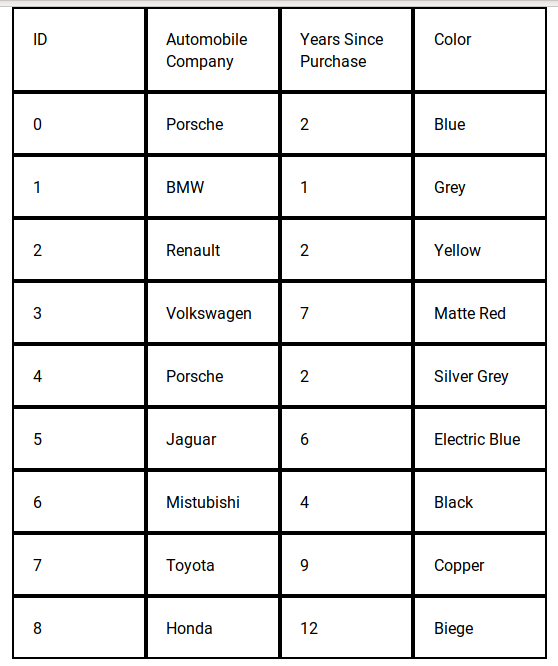
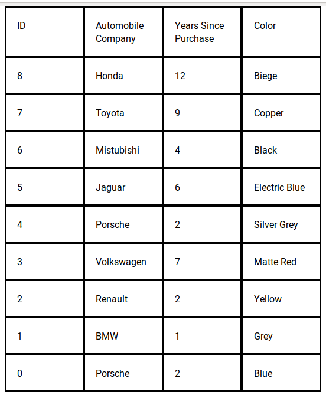
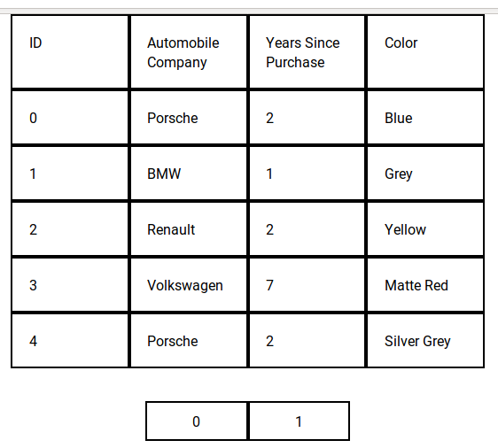

When I started out with React, I wrote a very messy table component that had a class component that did most of the work. Everything else such as sort, pagination and filters was pluggable by importing the appropriate util function and binding it to the class. After that initialization was required which would call a function inside the imported util function that set up some defaults in the component's state. It was hard to reason about and anyone else looking at the code would have be flabbergasted. With hooks though this can be written very cleanly. This is what I'll be attempting to do in this, albeit a much much much more simplistic version.

We're going to start out building simple table components such as the table rows, the header and the table cells. We hook up some state variables after that that perform initalization, that is - normalizing data by consuming a function that the user passed and then normalizing the data further to something that the table component can consume. After that we work on the data a little more to perform sort and pagination. Filters are beyond the scope of this post.

## Building our super simple table components
Let's look at the code that drive our table and the syntax of the data that it consumes.

### Table header
```js
function TableHeader({ headers }) {

  return (
    <thead className="table-row">
      {
        headers.map((d) => <TableCell data={d} />)
      }
    </thead>
  )
}
```

and it consumes something similar to
```js
const meta = [
  {
    key: 'id',
    text: 'ID',
    sort: true,
  },
  {
    key: 'name',
    text: 'Automobile Company',
    sort: true,
  },
  {
    key: 'age',
    text: 'Years Since Purchase',
    sort: true,
  },
  {
    key: 'color',
    text: 'Color',
    sort: true,
  },
]
```

### Table Data
```js
function TableData({ data, meta }) {
  const headerOrder = meta.map(m => m.key);
  return (
    <tbody>
      {
        data.map((row) => (
          <tr className="table-row">
            {
              row.map((_, i) => <TableCell data={row.find(r => r.key === headerOrder[i])} />)
            }
          </tr>
        ))
      }
    </tbody>
  )
}
```

and it consumes something like

```js
const data = [
  { name: 'Porsche', age: 2, color: 'Blue' },
  { name: 'BMW', age: 1, color: 'Grey' },
  { name: 'Renault', age: 2, color: 'Yellow' },
  { name: 'Volkswagen', age: 7, color: 'Matte Red' },
  { name: 'Porsche', age: 2, color: 'Silver Grey' },
  { name: 'Jaguar', age: 6, color: 'Electric Blue' },
  { name: 'Mistubishi', age: 4, color: 'Black' },
  { name: 'Toyota', age: 9, color: 'Copper' },
  { name: 'Honda', age: 12, color: 'Biege' },
].map((d, id) => ({ ...d, id }));
```

The data can come in in whatever fashion it pleases. We shall run it through a data normalization function that cleans it up so that it can be consumed by our table component.


### Table Cell
This is used by both our table data and the header components.
```js
function TableCell ({ data }) {
  return (
    <td className="table-cell" onClick={data.sortFunc}>
      {data.text}
    </td>
  )
}
```
 Putting all of these together and with a little bit of styling, we finally have:

 ```js
function Table({ normalizeData }) {
  const [headerMeta, setHeaderMeta] = useState(meta);
  const [tableData, setTableData] = useState([]);

  useEffect(() => {
    // normalize data
    setTableData(normalizeData(data), meta);
  }, []);

  return (
    <div className="container">
      <TableHeader headers={headerMeta} />
      <TableData data={tableData} meta={meta} />
    </div>
  );
}
 ```

 Which gives:

 


 Normalization function for the data we have declared above
 ```js
 function normalizeData(data) {
  return data.map(td => {
    const keys = Object.keys(td);
    return keys.map(key => ({ key, text: td[key] }));
  });
}
```

## useState and useEffect

 For the uninitiated, there're two little things here that might be new - **useState** and **useEffect**. *useState* is simply adding a state variable to your classless component. It takes an inital value, in our case, for the *headerMeta* it is the initial meta defined earlier and for the *tableData* it is simply an empty array. The *useState* function returns an array which is being destructured into the data and the setter function in positions 0 and 1 respectively. You can use the setter function to set the data similar to the *setState* which you might be used to and get the data back on the appropriate keys that've been defined, it being *headerMeta* and *tableData* in our case.

 Moving on to *useEffect*, it takes a function as the position 1 argument and a variable as the position 2 argument. The function is run everytime the position 2 variable is changed. For instance in our case it's an empty array, so it only runs once when the component loads similar to the *componentDidMount* function. However if it were to have *tableData* as the second argument, we would very well run into an infinite loop because we call the *setTableData* function inside the effect which sets the *tableData* and changes in *tableData* is something like our *shouldComponentUpdate* function here. Also note that *useEffect* always takes an array as its 2nd argument, so multiple variables can be used to control updates.

## Adding functionality 
We'll take it one step at a time.

### Sort
Let's start out with sort. Adding sort is going to require changing both the header, so that it knows if it's currently sorting ascending or descending. For this to happen we modify the meta. Then we actually perform the sort on the data. To this effect, we shall be using two effects. Our *TableCell* component already has the onClick attached to it. So, we're all set and only need to make changes to our *Table* component.

Write something to hold the sort state.
```js
const [sortBy, setSortBy] = useState({key: null, order: '>' });
```

A little bit of a fluff function that is used to sort ascending or descending.
```js
const compare = {
  '>': (d1, d2) => d1 > d2,
  '<': (d1, d2) => d1 < d2,
};
```

The effect where the sort actually happens.
```js
useEffect(() => {
    // sorts raw data > normalizes data > sets as tableData
    setTableData(normalizeData(data.sort((d1, d2) => compare[sortBy.order](d1[sortBy.key], d2[sortBy.key]))));
  }, [sortBy]);
```

This effect updates our data everytime the *sortBy* variable changes, which happens when a header is clicked if it has sort enabled. It simply calls a the array sort function then normalizes the data and puts it back into the *tableData* variable with *setTableData*.

The header setup.
```js
setHeaderMeta((currentHeaderMeta) => {
    // changes the meta the header uses to pass the approriate sort function
    currentHeaderMeta.map((m) => m.sort ? { ...m, sortFunc: () => sortFunc(m) } : m));
 }, [sortBy]);
```

This binds the sort function *sortFunc* initially when the component mounts and then everytime the *sortBy* variable changes.

 


### Pagination
Next up is pagination. 

```js
const pageSize = 5; // meta information

const [currentPage, setCurrentPage] = useState(0);

useEffect(() => {
  // paginate
  const startPointer = currentPage * pageSize;
  const endPointer = startPointer + pageSize
  setTableData(normalizeData(data.slice(startPointer, endPointer)));
}, [sortBy, currentPage]);
```
Our state starts with page number at 0 and it simply cuts sets the appopriate content.

A pretty straightforward paginator component.
```js
function Paginator ({ page, setPage, size }) {
  return (
    <div className="table-row paginator">
      {
        Array(size).fill(0).map((_, i) => (
          <div className="paginator-block" onClick={() => setPage(i)}>
            {i}
          </div>
        ))
      }
    </div>
  );
}
```

And call it as
```js
<Paginator page={currentPage} setPage={setCurrentPage} size={Math.ceil(data.length / pageSize)} />
```

 

 ### The complete table component
Putting everything together, we have:
 ```js
import React, { useEffect, useState } from 'react';

import Paginator from './Paginator';
import TableHeader from './TableHeader';
import TableData from './TableData';

import './App.css';

const data = [
  { name: 'Porsche', age: 2, color: 'Blue' },
  { name: 'BMW', age: 1, color: 'Grey' },
  { name: 'Renault', age: 2, color: 'Yellow' },
  { name: 'Volkswagen', age: 7, color: 'Matte Red' },
  { name: 'Porsche', age: 2, color: 'Silver Grey' },
  { name: 'Jaguar', age: 6, color: 'Electric Blue' },
  { name: 'Mistubishi', age: 4, color: 'Black' },
  { name: 'Toyota', age: 9, color: 'Copper' },
  { name: 'Honda', age: 12, color: 'Biege' },
].map((d, id) => ({ ...d, id }));

const meta = [
  {
    key: 'id',
    text: 'ID',
    sort: true,
  },
  {
    key: 'name',
    text: 'Automobile Company',
    sort: true,
  },
  {
    key: 'age',
    text: 'Years Since Purchase',
    sort: true,
  },
  {
    key: 'color',
    text: 'Color',
    sort: true,
  },
]

const pageSize = 5;

function normalizeData(data) {
  return data.map(td => {
    const keys = Object.keys(td);
    return keys.map(key => ({ key, text: td[key] }));
  });
}


const compare = {
  '>': (d1, d2) => d1 > d2,
  '<': (d1, d2) => d1 < d2,
}

function App() {
  const [headerMeta, setHeaderMeta] = useState(meta);
  const [tableData, setTableData] = useState([]);
  const [sortBy, setSortBy] = useState({key: null, order: '>' });
  const [currentPage, setCurrentPage] = useState(0);

  useEffect(() => {
    function sortFunc(m) {
      setSortBy({ key: m.key, order: sortBy.order === '>' ? '<' : '>' });
    }

  setHeaderMeta(
      (currentHeaderMeta) => currentHeaderMeta.map((m) => m.sort ? { ...m, sortFunc: () => sortFunc(m) } : m)
    );
  }, [sortBy]);

  useEffect(() => {
    // normalize data
    setTableData(normalizeData(data), meta);
  }, []);

  useEffect(() => {
    // sort
    setTableData(normalizeData(data.sort((d1, d2) => compare[sortBy.order](d1[sortBy.key], d2[sortBy.key]))));
  }, [sortBy])

  useEffect(() => {
    // paginate
    const startPointer = currentPage * pageSize;
    const endPointer = startPointer + pageSize
    setTableData(normalizeData(data.slice(startPointer, endPointer)));
  }, [sortBy, currentPage]);

  return (
    <div className="container">
      <TableHeader headers={headerMeta} />
      <TableData data={tableData} meta={meta} />
      <Paginator page={currentPage} setPage={setCurrentPage} size={Math.ceil(data.length / pageSize)} />
    </div>
  );
}

export default App;
```

This can be easily extended to add filters but since it requires some more UI work based on the type of input it acts up on - such as numbers might need sliders and text might need an input box, I won't be doing that.

One little thing that needs to be addressed is chaining changes. Sometimes the state variable might not have the latest data and when you want to set the state depending on the last know value of the state variable, a function can be passed instead of a variable. This is already done (though probably not required) in our headerMeta effect.

```js
useEffect(() => {
  function sortFunc(m) {
    setSortBy({ key: m.key, order: sortBy.order === '>' ? '<' : '>' });
  }

  setHeaderMeta(
    (currentHeaderMeta) => currentHeaderMeta.map((m) => m.sort ? { ...m, sortFunc: () => sortFunc(m) } : m)
  );
}, [sortBy]);
```

The *setHeaderMeta* state setter function here takes an argument and makes the current state value available to us as the first argument.