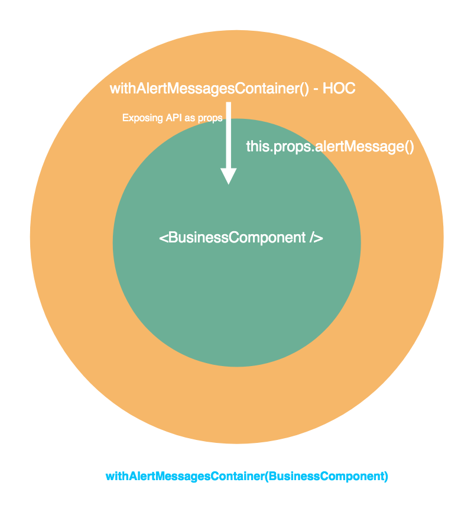

Alert Messages act as feedback about the operation initiated by the end-user or the application itself. Alert messages will be a part of any application irrespective of their type. As almost any React Application needs to deal with Alert Messages, let’s take a look on how to develop reusable alert components.

How error messages will be usually handled in a simple React component.

```jsx
class SampleApp extends React.Component {
  constructor(props) {
    super(props)
    this.state = {
      errorMessages: [],
    }
  }

  componentDidMount() {
    try {
      /* make an api call
    	      set the state with response */
      throw Error("API Error")
    } catch (e) {
      this.setState({
        errorMessages: [...this.state.errorMessages, e.message],
      })
    }
  }

  clearMessages() {
    this.setState({
      errorMessages: [],
    })
  }

  render() {
    const { errorMessages } = this.state

    return (
      <div>
        {errorMessages.map(message => (
          <div>{message}</div>
        ))}
        <div>
          <button onClick={_e => this.clearMessages()}>Clear Messages</button>
        </div>
      </div>
    )
  }
}

ReactDOM.render(<SampleApp />, document.querySelector("#app"))
```

There are few drawbacks in this approach.

**Code Duplication —** Error Messages are stored in the local state of the component. Therefore the logic to manage these messages will be duplicated across all components displaying alert messages.

**Maintenance —** Any minor customization will result in changing the logic across all the components. In a project with hundreds of components, imagine how much time will be consumed for a simple tweak.

> ## More Power — More Responsibility
>
> ## More Code — More Pain

What can we do to tackle these drawbacks?

1. Logic related to messages management (setting, displaying and clearing messages) should be moved to a common module.
2. The common module should be made as a reusable component so that all the components can be wrapped inside and rendered.

`export default withAlertMessagesContainer(SampleApp)`

But wait, does it sound like [Higher-Order Components](https://reactjs.org/docs/higher-order-components.html)? Yes, it is!

We are going to design a higher-order component which will implement all the Messages-Management Logic extracted from the business logic components.

---

## Required Functionalities in Alert Messages Container (HOC)

1. _Setting the messages_ in the HOC state to display — [State is required](https://reactjs.org/docs/thinking-in-react.html#step-3-identify-the-minimal-but-complete-representation-of-ui-state) as the messages cannot be computed programmatically or derived from the existing data
2. _Displaying the messages_ retrieved from the state
3. _Clearing out the messages_ based on a configured timeout or upon user interaction

The messages state is residing in HOC. But the message will be originated from the wrapped component ( SampleApp in our case). So, how the messages state in HOC can be updated from SampleApp?

Whenever the state in the parent component has to be updated from the child component, the instance methods of the parent component will be passed as props down to the child component.

Logic Reusability is achieved by exposing APIs of the Higher-Order component as props to the wrapped component. Whenever the component is wrapped inside HOC, the wrapped component gets access to the reusable logic by simply accessing/invoking the props.

Let’s implement the required functionalities by developing a higher-order component.

```jsx
const withAlertMessagesContainer = WrappedComponent => {
  return class extends React.Component {
    state = {
      messages: [],
    }

    /* API to be exposed as props to the wrapped component */
    alertMessage = {
      error: message => this.addMessage(message, "error"),
      success: message => this.addMessage(message, "success"),
      info: message => this.addMessage(message, "info"),
    }

    addMessage = (payload, type) => {
      const { messages } = this.state
      this.setState({
        messages: [
          {
            payload,
            type,
            id: _.now(),
          },
          ...messages,
        ],
      })
    }

    clearMessages = () => {
      this.setState({
        messages: [],
      })
    }

    isMultipleMessagesPresent = () => _.size(this.state.messages) > 1

    removeMessage = messageId => {
      const { messages } = this.state
      const updatedMessages = _.filter(
        messages,
        message => message.id !== messageId
      )

      this.setState({
        messages: updatedMessages,
      })
    }

    render() {
      const alertDialogs = _.map(
        this.state.messages,
        ({ payload, type, id }) => {
          return (
            <AlertDialog
              key={id}
              message={payload}
              type={type}
              handleOnClose={() => this.removeMessage(id)}
            />
          )
        }
      )

      return (
        <React.Fragment>
          <WrappedComponent alertMessage={this.alertMessage} />

          <div>
            <div>{alertDialogs}</div>
            <div>
              {this.isMultipleMessagesPresent() && (
                <ClearAlertDialog onClearClick={this.clearMessages} />
              )}
            </div>
          </div>
        </React.Fragment>
      )
    }
  }
}
```

Now we got a prototype of HOC. Let's define AlertDialog and ClearAlertDialog functional components that have been used in the HOC.

```jsx
/**
 *  message - error message, {string}
 *  type - [error, success, info] - Styling can be changed based on type
 *  handleOnClose - Close click event handler
 */
const AlertDialog = ({ message, type, handleOnClose }) => (
  <div
    data-notify="container"
    className={`alert ${type} animated bounce`}
    role="alert"
    data-notify-position="bottom-center"
  >
    <button
      onClick={handleOnClose}
      type="button"
      aria-hidden="true"
      className="close"
      data-notify="dismiss"
    />

    <span
      style={{
        wordBreak: "break-word",
      }}
    >
      {message}
    </span>
  </div>
)

/**
 *  onClearClick - Close click event handler - Clears all messages from the list
 */

const ClearAlertDialog = ({ onClearClick }) => (
  <div
    data-notify="container"
    className="alert clear-all-alert-wrapper"
    role="alert"
    data-notify-position="bottom-center"
    onClick={onClearClick}
  >
    <span type="button">Clear All</span>
  </div>
)
```

Let’s get it up and running.

```jsx
const SampleApp = ({ alertMessage }) => (
  <React.Fragment>
    {["error", "success", "info"].map(messageType => (
      <div key={messageType}>
        <button
          onClick={() => alertMessage[messageType](`It's ${messageType}`)}
        >
          {`Show ${messageType}`}
        </button>
      </div>
    ))}
  </React.Fragment>
)

export default withAlertMessagesContainer(SampleApp)
```

> Notice that `<SampleApp />` doesn’t require state or functions anymore, to handle alert messages. All it requires is a prop `alertMessage()`!

<iframe src="https://codesandbox.io/embed/withalertmessages-proto-hoc-x3v2e?fontsize=14" title="withAlertMessages-proto-HOC" allow="geolocation; microphone; camera; midi; vr; accelerometer; gyroscope; payment; ambient-light-sensor; encrypted-media; usb" style="width:100%; height:500px; border:0; border-radius: 4px; overflow:hidden;" sandbox="allow-modals allow-forms allow-popups allow-scripts allow-same-origin"></iframe>

---

In the current implementation, the alert dialogs can be removed only by the end-user. What if we can make the alerts removed by themselves in a configured manner? Well, it will be an icing on the cake.

### Requirements for Alerts Auto-Removal

- Callback to remove a specific message from the HOC messages state list (`handleOnClose()` is already available)
- A timer to invoke the callback once the specified time expires.

#### How to configure the timer with AlertDialog

- The timer [setTimeout](https://developer.mozilla.org/en-US/docs/Web/API/WindowOrWorkerGlobalScope/setTimeout)`(this.props.handleOnClose, timeout)` should be started once AlertDialog is rendered on the screen.

_This logic can be placed in componentDidMount() as this lifecycle method will be invoked immediately after the initial render_

- Clearing out the configured timer inside componentWillUnmount()

**Why the configured timer should be cleared?**

Assume the end-user has closed the alert before the timer does. Closing the alert means the Alert Component will be unmounted from the DOM. Even though the timer is set inside the React component, the timer is not bounded to React. It’s under the scope of browser [window](https://developer.mozilla.org/en-US/docs/Web/API/WindowOrWorkerGlobalScope) interface. There won’t be any issues in this case as handleOnClose only deals with state manipulation in mounted HOC, not with the unmounted AlertDialog component. Anyhow, it’s always a good practice to cancel the `componentDidMount()` subscriptions inside `componentWillUnmount()` to avoid unintended side effects.

---

#### Timer Configuration

AlertDialog should be changed into a class component to leverage component lifecycle methods.

_Note:_ Timer subscriptions can be handled inside a functional component using [Effect Hook](https://reactjs.org/docs/hooks-effect.html) since React v16.8. For simplicity, the traditional class component approach has been followed.

```jsx
class AlertDialog extends React.Component {
  componentDidMount() {
    _.isNumber(this.props.timeout) &&
      (this.timer = window.setTimeout(
        this.props.handleOnClose,
        this.props.timeout
      ))
  }

  componentWillUnmount() {
    this.timer && window.clearTimeout(this.timer)
  }

  render() {
    const { message, type, handleOnClose } = this.props

    return (
      <div
        data-notify="container"
        className={`alert ${type} animated bounce`}
        role="alert"
        data-notify-position="bottom-center"
      >
        <button
          onClick={handleOnClose}
          type="button"
          aria-hidden="true"
          className="close"
          data-notify="dismiss"
        >
          x
        </button>

        <span
          style={{
            wordBreak: "break-word",
          }}
        >
          {message}
        </span>
      </div>
    )
  }
}
```

```jsx
const withAlertMessagesContainer = WrappedComponent => {
  return class extends React.Component {
    /* .....*/

    /* Receive timeout option alongside message string */
    alertMessage = {
      error: (message, { timeout }) =>
        this.addMessage(message, "error", { timeout }),
      success: (message, { timeout }) =>
        this.addMessage(message, "success", { timeout }),
      info: (message, { timeout }) =>
        this.addMessage(message, "info", { timeout })
    };

    addMessage = (payload, type, options = {}) => {
      const { messages } = this.state;

      /* set timeout value in state to pass in AlertDialog */
      this.setState({
        messages: [
          {
            payload,
            type,
            id: _.now(),
            timeout: options.timeout
          },
          ...messages
        ]
      });
    };


    /* .....*/

    <!-- Pass timeout to AlertDialog extracted from message object -->
    render() {
      const alertDialogs = _.map(
        this.state.messages,
        ({ payload, type, id, timeout }) => {
          return (
            <AlertDialog
              key={id}
              message={payload}
              type={type}
              timeout={timeout}
              handleOnClose={() => this.removeMessage(id)}
            />
          );
        }
      );

      return (
        /* .....*/
      );
    }
  };
};
```

```jsx
// in ms
const ALERT_TIMEOUTS = {
  error: 4000,
  success: 3000,
  info: 3000,
}

const SampleApp = ({ alertMessage }) => (
  <React.Fragment>
    {["error", "success", "info"].map(messageType => (
      <div key={messageType}>
        <button
          onClick={() =>
            alertMessage[messageType](`It's ${messageType}`, {
              timeout: ALERT_TIMEOUTS[messageType],
            })
          }
        >
          {`Show ${messageType}`}
        </button>
      </div>
    ))}
  </React.Fragment>
)
```

The Final Version with timer option …

<iframe src="https://codesandbox.io/embed/withalertmessages-hoc-final-buiff?fontsize=14" title="withAlertMessages-HOC-final" allow="geolocation; microphone; camera; midi; vr; accelerometer; gyroscope; payment; ambient-light-sensor; encrypted-media; usb" style="width:100%; height:500px; border:0; border-radius: 4px; overflow:hidden;" sandbox="allow-modals allow-forms allow-popups allow-scripts allow-same-origin"></iframe>

## Conclusion

Higher-Order Component (HOC) is similar to Higher-Order Function (HOF) in JavaScript. HOF takes in a function and returns a function whereas the HOC takes in a component and returns another component.

Whenever you encounter a JS codebase with repetitive code, the duplicates can be removed by moving the logic to pure functions and modules. Similarly, any repetitive logic found in business components can be moved to Higher-Order Components. HOCs make the codebase cleaner and readable by viewing the React Application as a composition of small and reusable components rather than a single complex entity.

### TheEndHOC(Article)

## Further References

1. [React Hooks](https://reactjs.org/docs/hooks-intro.html)
2. [React-Alert](https://github.com/schiehll/react-alert)
3. [Atomic React](http://bradfrost.com/blog/post/atomic-web-design/)
