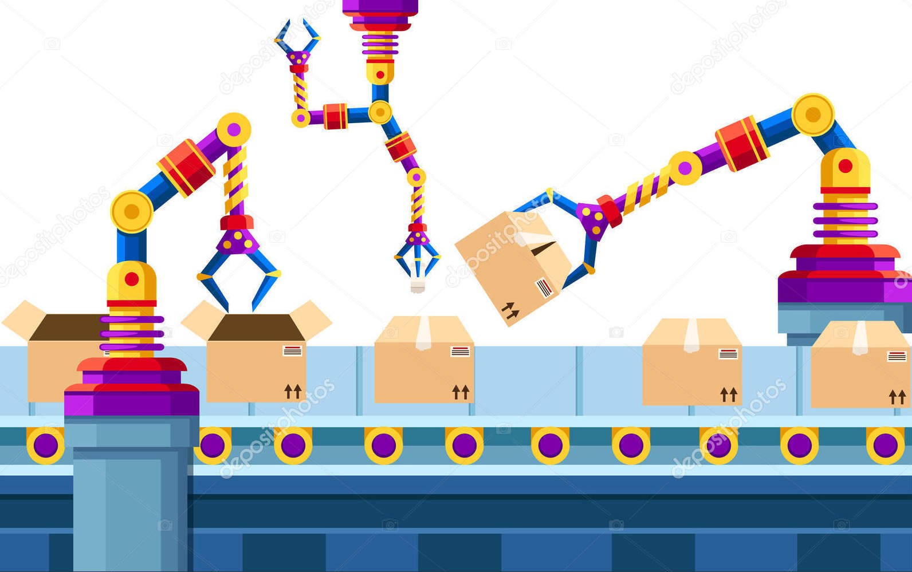
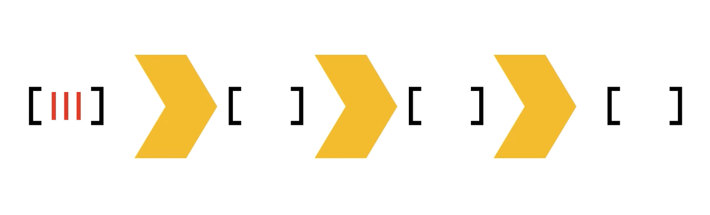
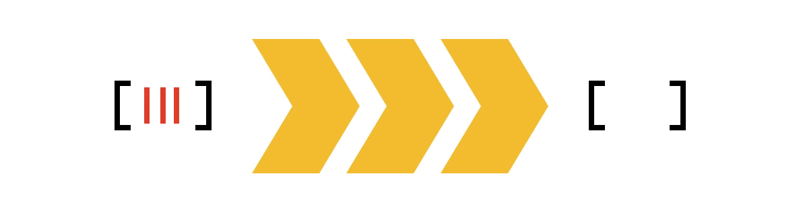
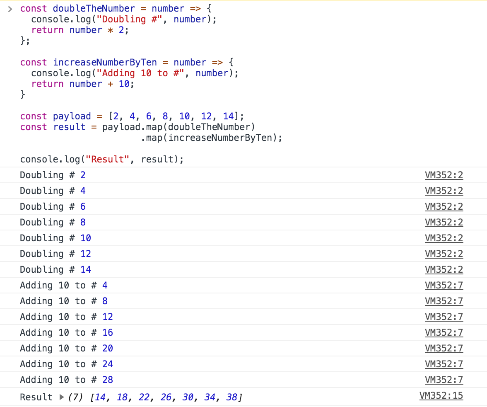
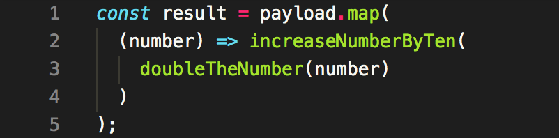
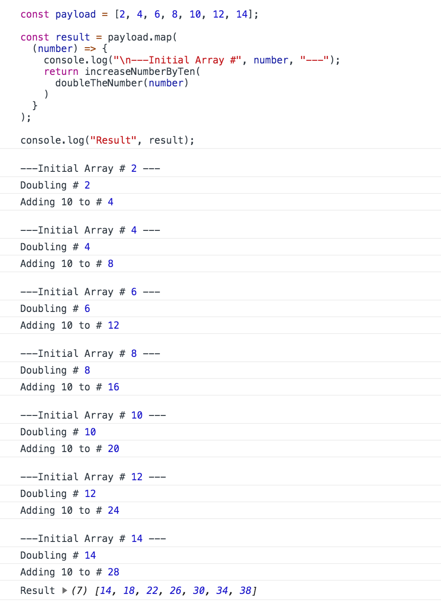
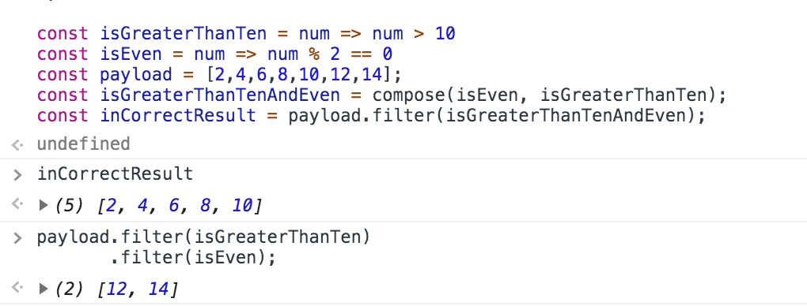
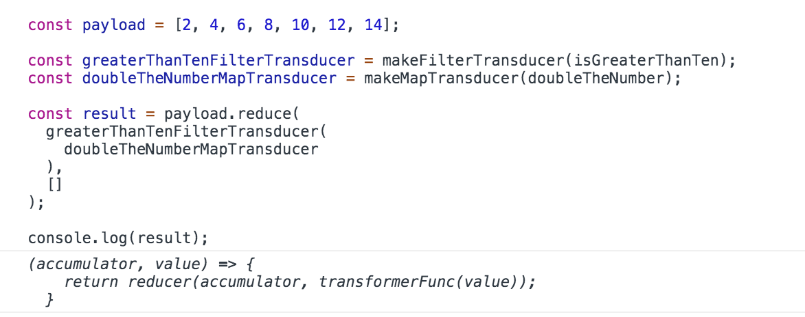

Visualize an empty box traveling in the assembly line, is an element in a JavaScript Array whereas each robotic arm is a pure function, performing a specific operation on an array element. Each empty box in an initial array is processed by a series of operations (robotic arms) to produce a packaged box that is added to the resultant array (product bundle).

Let’s realize this analogy using JavaScript functions.

```jsx
const emptyBoxes = []

const productsBundle = emptyBoxes
  .map(addProduct)
  .map(closeBox)
  .map(wrapBox)
```

Seems the function chaining is resembling the analogy. But there is a catch!

_There is a major difference in how many times, the array elements are parsed in each methodology!_

In the assembly line, the entire array (series of empty boxes) is parsed only once (An empty box going through the entry point will come out as a final product at the exit point in a single trip).

But in the JavaScript implementation, the boxes are parsed three times!

## Why !?

Whenever a function chaining is performed on an array, JavaScript builds up a whole new intermediate array before moving onto the next available function in the chain. The provided JavaScript implementation operates on the array by chaining three mapper functions. As a result, three intermediate versions of `productsBundle` would be created to arrive at the final bundle.

Interpreting how the above-provided programmatical implementation works.

```jsx
const boxesWithProduct = emptyBoxes.map(addProduct)
const closedBoxes = boxesWithProduct.map(closeBox)
const productsBundle = closedBoxes.map(wrapBox)
```

##### JavaScript Simulation of Assembly Line Processing



##### Actual Assembly Line Processing



---

As a manufacturer, how would you expect your assembly line to process the items?

It’s a no-brainer! Only once irrespective of the number of operations performed on the items.

**Why?** The conveyor belt needs to move an item only once rather than the number of robotic arms times. This implementation increases its life by minimizing tear down and saves electricity. As a result, profit can be maximized.

In the programming equivalent, our profit will be processing time. The rest of the article explains how functions can be combined in a way where elements collection will be enumerated only once, irrespective of the number of operations(functions) in the pipeline.

## Efficient One-Time Traversal Using Functional Composition

Before diving into the implementation, [this article](/how-to-get-complete-leverage-from-javascript-reduce) can be referred to, if you feel Functional Composition is new or if you want to recall ideas.

Long story short, Functional Composition is a process of combining multiple functions to form a single complex function. Imagine each function involved in the function composition is a building block of Transformer toys. When all the building blocks (individual pure functions) are combined, a mighty Transformer toy (composed function) can be built.

### Array Traversal in Function Chaining

Let’s consider a numerical example for a detailed explanation.
Given an array of numbers, double the numbers and then increase the doubled numbers by ten.

```jsx
const doubleTheNumber = number => number * 2
const increaseNumberByTen = number => number + 10

const payload = [2, 4, 6, 8, 10, 12, 14]
const result = payload.map(doubleTheNumber).map(increaseNumberByTen)

//=> [14, 18, 22, 26, 30, 34, 38]
```

Let’s add a console statement in the functions so that a clear picture can be obtained where intermediate arrays are processed on every chain.

_Consoling processable number to show a new intermediate array is created before processed by next function in the chain_

Here’s how the result is formed.

```jsx
[2, 4, 6, 8, 10, 12, 14] => [4, 8, 12, 16, 20, 24, 28] => [14, 18, 22, 26, 30, 34, 38]
```

### Array Traversal using compose()

To traverse the array only once, the array element should be passed to `doubleTheNumber()` and the output of `doubleTheNumber()` should be immediately passed to `increaseNumberByTen()` . This process should be repeated for all input elements until the resultant array is formed.

_Composing the functions manually_

_Composed Function Traversed Array only once_

#### Why compose()? — Programmatical Composition

Now, you may be wondering why we need a custom function `compose()` if we can compose functions by ourselves. Imagine you have to compose five functions to form a complex function as per the business logic. It will look like the following.

```jsx
const composedFunc = arg => func5(func4(func3(func2(func1(arg)))))
```

With `compose()`,

```jsx
const compose = (...functions) => value =>
  functions.reduceRight((currValue, currFunc) => currFunc(currValue), value)
```

the above implementation can be realized by following

```jsx
const composedFunc = arg =>
  compose(
    func5,
    func4,
    func3,
    func2,
    func1
  )(arg)
```

_The `compose()` enables us to hold a reference for composed functions, making it easier to apply whenever required rather than composing the functions manually every single time._

The solution to our numerical problem can be designed as follows:

```jsx
const doubleAndIncreaseNumberByTen = compose(
  increaseNumberByTen,
  doubleTheNumber
)

const result = payload.map(doubleAndIncreaseNumberByTen)
```

### Type Signatures — Friction

Functional composition works until the type signature of the composable functions is compatible.

A mapper function takes a single argument and returns a single new value. The return value of a mapper function can be accepted as a single argument by the next mapper function in the pipeline.

```jsx
doubleTheNumber: number => transformedNumber
increaseNumberByTen: transformedNumber => transformedNumber
```

Let’s consider a filtering problem to illustrate the type-signature issue.

```jsx
const isGreaterThanTen = num => num > 10
const isEven = num => num % 2 == 0
const payload = [2, 4, 6, 8, 10, 12, 14]
const isGreaterThanTenAndEven = compose(
  isEven,
  isGreaterThanTen
)
const result = payload.filter(isGreaterThanTenAndEven)
// It won't work :((((
```

_Composing Predicate Functions returned an incorrect result_

Let’s visualize the type signatures of our filter function.

```jsx
isGreaterThanTen: number => boolean
isEven: number => boolean
```

But how the arguments are processed when our predicate functions are composed,

```jsx
isGreaterThanTen: number => boolean
isEven: number => boolean
```

When `isEven()` is expecting a number, `isGreatherThanTen()` is returning a boolean. The number processed by `isGreatherThanTen()` is no longer available to `isEven()` . If the chained function loses the context of the value, the composed function will not behave as intended.

A similar issue will be raised when reducer functions are composed. A reducer function requires two arguments `(accumulator, currentValue)` as input but returns only a single value `(accumulator)`.

> If different type-signatures obstruct functional composition, how can the mapper functions, predicate functions, and reducer functions be composed as they’re essential functional components of solving almost any logical problem?

## Transducers to the rescue!

> ### A transducer is a higher-order reducer. It accepts a reducer as an argument and returns another reducer.

```jsx
transducer: reducer => anotherReducer
```

Since transducer always accepts and returns a reducer, it can be composed to any level.

```jsx
f: reducer => reducer
g: reducer => reducer
h: reducer => reducer

//And so on
```

> If the transducer only accepts a reducer function, how can the _mapper_ and _predicate_ functions be used?

We’re going to implement `map()` and `filter()` using `reduce()`!

Don’t under-estimate the power of `reduce()`!!!

### Simulation of map() and filter() using reduce()

```jsx
const filterReducer = predicateFunc => {
  return (accumulator, value) => {
    if (predicateFunc(value)) {
      accumulator.push(value)
    }
    return accumulator
  }
}
const mapReducer = transformerFunc => {
  return (accumulator, value) => {
    accumulator.push(transformerFunc(value))
    return accumulator
  }
}
```

Let’s test our implementation.

```jsx
const payload = [2, 4, 6, 8, 10, 12, 14]
const isGreaterThanTenReducer = filterReducer(isGreaterThanTen)
const doubleTheNumberMapper = mapReducer(doubleTheNumber)
payload.reduce(isGreaterThanTenReducer, []).reduce(doubleTheNumberMapper, [])
//=> [24, 28]
```

But wait, this implementation contains `reduce()` chaining!!!
This means an intermediate array will be created and passed onto the next function in the pipeline.

_Hang on! When you’re building a wall, always focus on laying brick by brick, one by one._

With mapper and predicate decorator functions, any functionality can be simulated by `reduce()`. Now we’re going to implement the actual transducer. The `filterReducer()` and `mapReducer()` functions will accept a second level argument (a reducer function) and it’s going to return another reducer function.

```jsx
transducer: reducer => anotherReducer
```

### Transducers — Building with Composable Reducers

```jsx
const makeFilterTransducer = predicateFunc => reducer => {
  return (accumulator, value) => {
    if (predicateFunc(value)) {
      return reducer(accumulator, value)
    }
    return accumulator
  }
}
const makeMapTransducer = transformerFunc => reducer => {
  return (accumulator, value) => {
    return reducer(accumulator, transformerFunc(value))
  }
}
```

The following function calls will return a function that accepts a reducer and returns a transformed reducer.

```jsx
makeFilterTransducer(predicateFunc): (reducer) => anotherReducer

makeMapTransducer(mapperFunc): (reducer) => anotherReducer
```

Let’s test the transducers.

```jsx
const payload = [2, 4, 6, 8, 10, 12, 14]
const greaterThanTenFilterTransducer = makeFilterTransducer(isGreaterThanTen)
const doubleTheNumberMapTransducer = makeMapTransducer(doubleTheNumber)
payload.reduce(greaterThanTenFilterTransducer(doubleTheNumberMapTransducer), [])
```

_Composing Transducers always return another transducer_

Strange! The composed transducers are returning a reducer function rather than a resultant array. Why?

#### Final Level Reducer

The transducer accepts a reducer function and always returns a transformed version of the input reducer. Hence, at the end of the function pipeline, a reducer function would be returned rather than the desired result.

As transducer only accepts a reducer function as its argument, the final accumulator function should be a reducer which accumulates the result rather than returning another reducer.

For the given problem statement, we require a reducer which takes `currentValue` and push it to the `accumulator[]`. Let’s implement the required reducer using `mapReducer`.

```jsx
// Accept a number and return the number as it is
const numberIdentityFunc = number => number
const valuesAccumulatorReducer = mapReducer(numberIdentityFunc)

const result = payload.reduce(
  greaterThanTenFilterTransducer(
    doubleTheNumberMapTransducer(valuesAccumulatorReducer)
  ),
  []
)
// => [24, 28]
```

Let’s leverage `compose()`!

```jsx
const generateResultTransducer = compose(
  greaterThanTenFilterTransducer,
  doubleTheNumberMapTransducer
)

const result = payload.reduce(
  generateResultTransducer(valuesAccumulatorReducer),
  []
)
```

> With transducers and functional composition, any number of functions can be composed as long as they are transducers. Any input collection passed to the composed transducers will be parsed only once irrespective of number of functions and their unique nature, involved in the composition.

### Why Transducer Libraries? — Keep it simple and safe

We’ve implemented only a simple version of the Transducer. The transducers can be completely leveraged when used in complex data applications such as collections, streams, channels, and observables. To make transducers compatible across different applications, they need to follow a few rules such as [Init, Result, and Step](https://github.com/cognitect-labs/transducers-js#transformer-protocol). Hence, it’s safe and better to use [library-implemented transducers](https://ramdajs.com/docs/#transduce) as they follow transducer protocols.

## Real-World Example

A simple numeric array has been used for demonstration for the sake of simplicity. Let’s consider a real-world example.

Imagine you have your Expense Manager Application with millions of categorized transactions logged over the decade in the form of JS objects. In the quest of your financial freedom, you’ve rigorously logged every single transaction ranging from your first-ever Starbucks Coffee to your latest Spotify subscription payment.

### That Feeling!

One fine day, you got a feeling that you’re spending a lot on dining during weekends. So, you wanted to know how much money you have spent on dining `categoryFilter` only during the weekends `dayFilter` in the last five years `dateFilter`. Consider the function-chaining implementation.

```jsx
millionsOfTransactions
  .filter(transactionWithinLastFiveYears)
  .filter(transactionFallingOnWeekend)
  .filter(transactionUnderDining)
  .reduce(transactionAmountsAggregator)
```

Even though the number of transactions processed by each function in the chain will be downsized due to the filtering performed by preceding predicate functions, an intermediate array with millions of objects will be created three times!

With the transducers, transactional objects will be parsed only once!

```jsx
const diningSpentTransducer = compose(
  transactionUnderDining,
  transactionFallingOnWeekend,
  transactionWithinLastFiveYears
)

millionsOfTransactions.reduce(
  diningSpentTransducer(transactionAmountsAggregator),
  0
)
```

## Conclusion

Functional chaining _may be_ faster than transducers when working on smaller collections. Transducers will be an effective weapon when the processable data set is huge or when there’s a lot of functions involved in the pipeline. And as always, profiling the implementation provides better performance analysis.

When I started my programming journey a few years before, all I thought about [reduce()](https://developer.mozilla.org/en-US/docs/Web/JavaScript/Reference/Global_Objects/Array/reduce) is that it can be used to aggregate numeric array values in a functional way rather than C-style for-loops. Little did I know that `reduce()` can be used to simulate `map()` and `filter()` functions. Little did I know that `reduce()` is the building block of elegant Functional Composition and the mighty Transducers!

This thought drifts me back to my childhood memories of an animation character [Samurai Jack](https://en.wikipedia.org/wiki/Samurai_Jack), a warrior who would be gifted with a powerful sword by his father to destroy a tyrannical shape-shifting demon, Aku!

I would like to recall a scene that has been resonated with me for a long time. When Samurai Jack starts his single-minded journey on the quest to destroy Aku, his father would send-off saying,

> ## The Power lies not in the sword!
>
> ## But in the hands that use it!!!

Hope this content will make your inner warrior, treat `reduce()` as a powerful sword!
