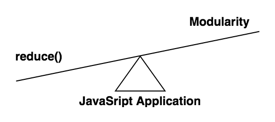
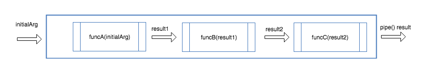

Functional Programming is the heart of JavaScript. Any complex problem can be nailed by proper application of functional programming concepts.

Consider a simple problem where the sum has to be computed, provided an array of integers.

```javascript
const numbers = [10, 20, 30, 40]

function sum(arr) {
  let result = 0

  for (let i = 0; i < arr.length; i++) {
    result = result + arr[i]
  }

  return result
}

console.log(sum(numbers)) // => 100
```

Functional Programmer knows it straight away how to solve this problem in a simpler way. Yes, it’s [Array.prototype.reduce](https://developer.mozilla.org/en-US/docs/Web/JavaScript/Reference/Global_Objects/Array/Reduce)

```javascript
const numbers = [10, 20, 30, 40]

const sumArray = arr => arr.reduce((acc, num) => acc + num, 0)

console.log(sumArray(numbers)) // => 100

/* More declarative way */

const sumNumbers = (numA, numB) => numA + numB

const sumTheArray = arr => arr.reduce(sumNumbers, 0)

console.log(sumTheArray(numbers)) //100
```

But wait,

- Can reduce() be used only with an array of primitive elements (numbers in this case)?
- As JavaScript functions are first-class variables, why can’t we use reduce() with an array of functions?

## API Data — Processing

Assume you are building a front-end application, a To-Do Manager which consumes data from API. Let the API response structure be in the following format:

```javascript
const tasks = [
  {
    id: 1,
    desc: "Email Proposal to Client",
    completed: true,
    priorityLevel: 2,
    tags: ["Work", "Urgent"],
    createdAt: "2019-06-24T11:17:34Z",
  },
  {
    id: 2,
    desc: "Buy Cake For Mom's Birthday",
    completed: false,
    priorityLevel: 1,
    tags: ["Personal", "Family"],
    createdAt: "2019-06-04T08:13:34Z",
  },
  {
    id: 3,
    desc: "Cancel my Netflix Subscription",
    completed: true,
    priorityLevel: 5,
    tags: ["Personal"],
    createdAt: "2019-06-22T11:33:34Z",
  },
]
```

You have to generate a weekly report of completed tasks with the following problem statement,

_Select only last 7 days’ completed tasks with the priority higher than 3rd level and tagged with “Work” and “Personal” labels. Capitalize each word in selected tasks’ description for better readability, then group the tasks by their tags._

### Chaining `Array.prototype` functions

```javascript
const filteredTasks = tasks
  .filter(
    task =>
      moment(task.createdAt).diff(moment().subtract(7, "days"), "days") > 0
  )
  .filter(task => task.completed)
  .filter(task => task.priorityLevel < 3)
  .filter(task => task.tags.includes("Work") || task.tags.includes("Personal"))
  .map(task => ({
    ...task,
    desc: task.desc
      .split(" ")
      .map(descWord => descWord.charAt(0).toUpperCase() + descWord.slice(1))
      .join(" "),
  }))
  .reduce((acc, task) => {
    task.tags.forEach(tag => {
      acc[tag] = task
    })

    return acc
  }, {})

console.log(filteredTasks)
```

This looks clean as each function takes care of a specific logic without impacting others. But wait, there is an issue here. What if the filter logic changes a bit?

- complete -> incomplete
- last 7 days -> last 14 days
- tags [“Work”, “Personal”] -> [“Urgent”]

Chaining anonymous functions won’t work in this case as the filter attributes are defined inside the function body. It can be made reusable only when the filter attributes are made configurable.

### Pure Functions with arguments

```javascript
const taskWithCompleteFlag = boolenFlag => task => task.completed === boolenFlag
const taskCreatedWithinDays = numberOfDays => task =>
  moment(task.createdAt).diff(moment().subtract(numberOfDays, "days"), "days") >
  0
const taskWithHigherPriority = priorityLevel => task =>
  task.priorityLevel < priorityLevel
const taskWithAnyTags = tags => task =>
  tags.reduce((boolAcc, tag) => boolAcc || task.tags.includes(tag), false)

const capitalizeWord = word => word.charAt(0).toUpperCase() + word.slice(1)
const capitalizeEachWord = template =>
  template
    .split(" ")
    .map(capitalizeWord)
    .join(" ")

const capitalizeTaskDescription = task => ({
  ...task,
  desc: capitalizeEachWord(task.desc),
})

const tagsGrouper = (acc, task) => {
  task.tags.forEach(tag => {
    acc[tag] = task
  })

  return acc
}

const filteredTasks = tasks
  .filter(taskCreatedWithinDays(7))
  .filter(taskWithCompleteFlag(true))
  .filter(taskWithHigherPriority(3))
  .filter(taskWithAnyTags(["Work", "Personal"]))
  .map(capitalizeTaskDescription)
  .reduce(tagsGrouper, {})

console.log(filteredTasks)
```

If the report needs to include tasks created within the last two weeks, filter call will be taskCreatedWithinDays(14) instead oftaskCreatedWithinDays(7).

By moving out the filter attributes from the function definition to the function arguments, filter logic is made completely configurable.

Assume that the report logic remains the same except that the tasks created within the last 31 days should be considered instead of 7. A solution can be designed similar to below snippet.

```javascript
const getCommonReportTasks = tasks =>
  tasks
    .filter(taskWithCompleteFlag(true))
    .filter(taskWithHigherPriority(3))
    .filter(taskWithAnyTags(["Work", "Personal"]))

const monthlyReportTasks = getCommonReportTasks(tasks)
  .filter(taskCreatedWithinDays(31))
  .map(capitalizeTaskDescription)
  .reduce(tagsGrouper, {})

console.log(monthlyReportTasks)
```

What about the problem statement alongside the following changes?

- Tasks which are incomplete instead of completed
- Tasks created within the last 2 months instead of last one week/month
- Priority Levels can be ignored

Solving these problems using this approach will result in a lot of redundant functions with slight changes. _Even though this approach is completely configurable, it’s not composable (combining functions to create a new function)._

## Function Pipelining to the rescue

Can you infer any traces of reduce()functionality in the last approach?

The tasks is an array which is processed by a series of functions. Each function (accumulator callback) in the series is filtering the array and finally, the array is transformed into an object (tags-grouped tasks).

### pipe()

```javascript
const pipe = (...functions) => value =>
  functions.reduce((currValue, currFunc) => currFunc(currValue), value)
```

> Provided a series of functions and an argument, the basic concept of pipe() is that the initial argument will be passed to the first function in the series (starting from left to right) and the result of the first function will be passed as an argument to the second function until the flow reached the last function in the series. Then the result from the last function in the series is returned as the result of pipe().
> (Similar to [Unix Pipeline](<https://en.wikipedia.org/wiki/Pipeline_(Unix)>))

```javascript
pipe(
  funcA,
  funcB,
  funcC
)(initialArg)

// equivalent to

(initialArg) => funcC(
  funcB(
    funcA(
      initialArg
    )
  )
)
```



Let’s apply `pipe()`.

```javascript
const pipe = (...functions) => value =>
  functions.reduce((currValue, currFunc) => currFunc(currValue), value)

/* Filter Functions tweaked to accept tasks array instead of single task object */

const tasksWithCompleteFlag = boolenFlag => tasks =>
  tasks.filter(task => task.completed === boolenFlag)
const tasksCreatedWithinDays = numberOfDays => tasks =>
  tasks.filter(
    task =>
      moment(task.createdAt).diff(
        moment().subtract(numberOfDays, "days"),
        "days"
      ) > 0
  )
const tasksWithHigherPriority = priorityLevel => tasks =>
  tasks.filter(task => task.priorityLevel < priorityLevel)
const tasksWithAnyTags = tags => tasks =>
  tasks.filter(task =>
    tags.reduce((boolAcc, tag) => boolAcc || task.tags.includes(tag), false)
  )

const capitalizeWord = word => word.charAt(0).toUpperCase() + word.slice(1)
const capitalizeEachWord = template =>
  template
    .split(" ")
    .map(capitalizeWord)
    .join(" ")

const capitalizeTasksDescription = tasks =>
  tasks.map(task => ({
    ...task,
    desc: capitalizeEachWord(task.desc),
  }))

const tasksTagsGrouper = tasks =>
  tasks.reduce((acc, task) => {
    task.tags.forEach(tag => {
      acc[tag] = task
    })
    return acc
  }, {})

const monthlyTasksReportProcessor = pipe(
  tasksWithCompleteFlag(true),
  tasksCreatedWithinDays(31),
  tasksWithHigherPriority(3),
  tasksWithAnyTags(["Work", "Personal"]),
  capitalizeTasksDescription,
  tasksTagsGrouper
)

const weeklyTasksReportProcessor = pipe(
  tasksWithCompleteFlag(true),
  tasksCreatedWithinDays(7),
  tasksWithHigherPriority(3),
  tasksWithAnyTags(["Work", "Personal"]),
  capitalizeTasksDescription,
  tasksTagsGrouper
)

console.log("Monthly Tasks", monthlyTasksReportProcessor(tasks))
console.log("Weekly Tasks", weeklyTasksReportProcessor(tasks))
```

This approach looks cleaner. But is it composable in nature?

Let’s apply the following changes discussed in the previous approach.

- Complete -> Incomplete
- P̶r̶i̶o̶r̶i̶t̶y̶ ̶L̶e̶v̶e̶l̶

```javascript
const categorizeBeautifiedTasks = pipe(
  capitalizeTasksDescription,
  tasksTagsGrouper
)

const weeklyIncompleteTasks = pipe(
  tasksWithCompleteFlag(false),
  tasksCreatedWithinDays(7)
)

const monthlyIncompleteTasks = pipe(
  tasksWithCompleteFlag(false),
  tasksCreatedWithinDays(31)
)

const monthlyTasksReportProcessor = pipe(
  monthlyIncompleteTasks,
  tasksWithAnyTags(["Work", "Personal"]),
  categorizeBeautifiedTasks
)

const weeklyTasksReportProcessor = pipe(
  weeklyIncompleteTasks,
  tasksWithAnyTags(["Work", "Personal"]),
  categorizeBeautifiedTasks
)

console.log("Monthly Tasks", monthlyTasksReportProcessor(tasks))
console.log("Weekly Tasks", weeklyTasksReportProcessor(tasks))
```

### How pipe() achieves function composition

```javascript
const categorizeBeautifiedTasks = pipe(
  capitalizeTasksDescription,
  tasksTagsGrouper
)

const weeklyCompletedTasks = pipe(
  tasksWithCompleteFlag(true),
  tasksCreatedWithinDays(7)
)

const weeklyTasksReportProcessor = pipe(
  weeklyCompletedTasks,
  tasksWithHigherPriority(3),
  tasksWithAnyTags(["Work", "Personal"]),
  categorizeBeautifiedTasks
)

console.log("Beautified Tasks", categorizeBeautifiedTasks(tasks))
console.log("Weekly Completed Tasks", weeklyCompletedTasks(tasks))
console.log("Weekly Task Report", weeklyTasksReportProcessor(tasks))
```

By pipelining functions with other pipes, a function can be created for any specific logic by combining (pipelining) two or more simpler functions.

> Pipelining makes the code cleaner and readable by viewing the application as a series of small and reusable functions rather than a single complex entity.

And it all started with reduce()!!!

## Further References

- [Lodash — flow()](https://lodash.com/docs/4.17.11#flow)
- [Pipeline Operator](https://developer.mozilla.org/en-US/docs/Web/JavaScript/Reference/Operators/Pipeline_operator)
- [Point-Free Style Programming](https://en.wikipedia.org/wiki/Tacit_programming)
