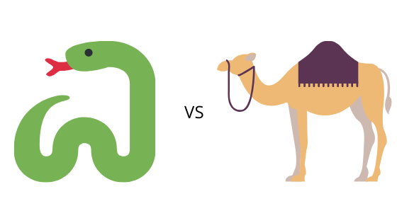
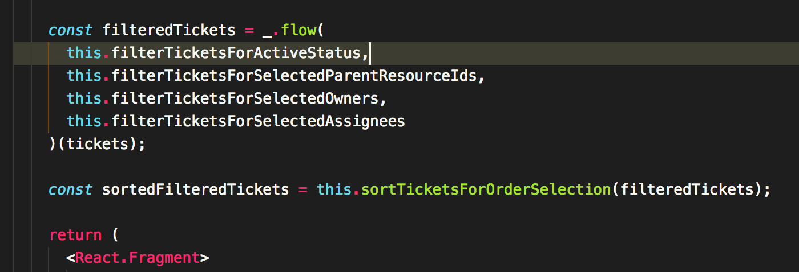
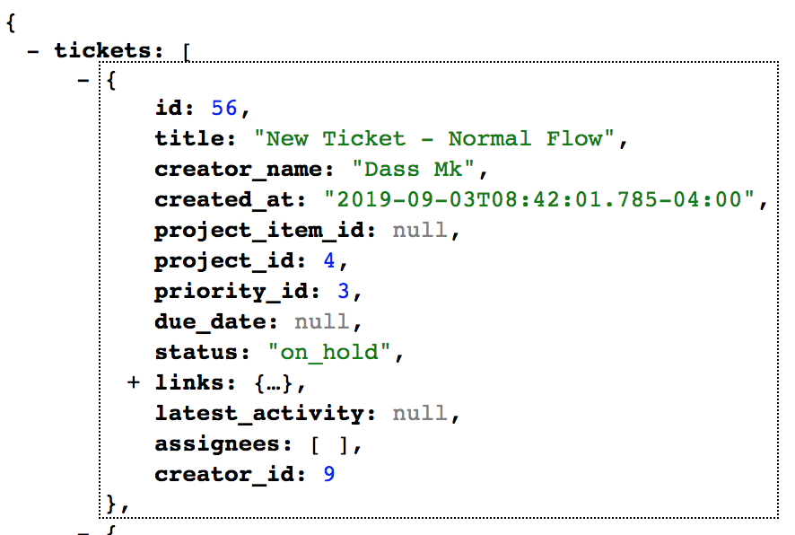
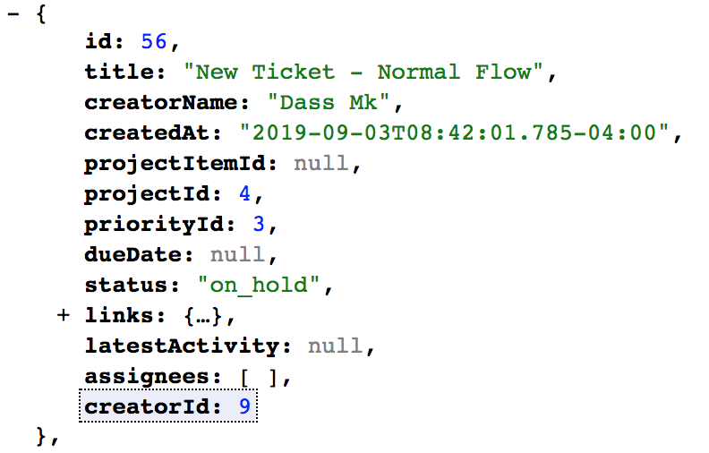
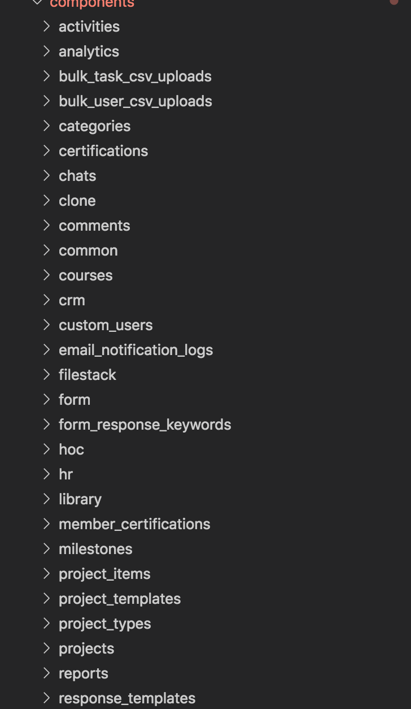
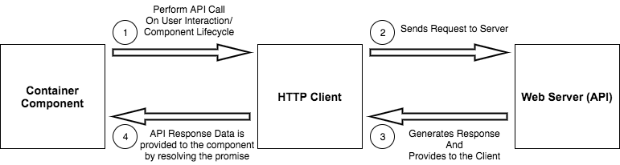
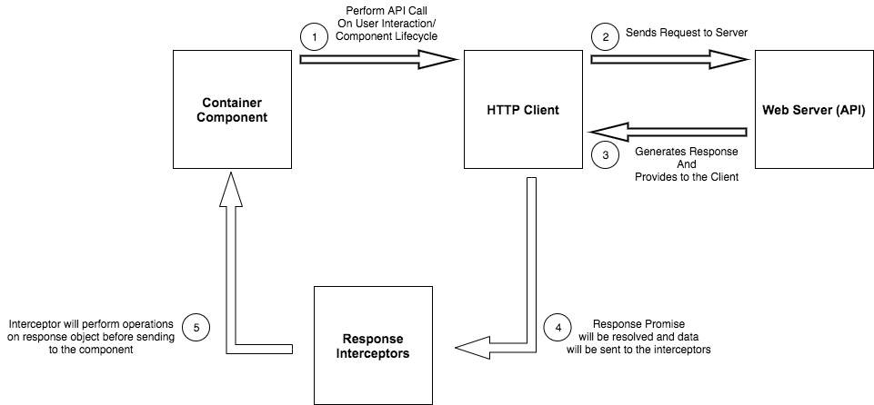

Imagine you’re a React.js Developer working in an application with Python/Ruby API. And you’re at the peak flow of your functional programming when you wrote something similar to the following screenshot.

_Piping the functions_

This screengrab was special to you that it even became one of your journal entries. But your happiness doesn’t last too long!

## Turbulence from the client

A few days later, you’re receiving an urgent-text from your client.

> **All the views in the entire application is breaking!!!**
>
> **Fix it ASAP!!!**

Feeling completely bewildered how every single view can break, you’re navigating to your most favorite _Tickets View_ to find out the root cause of the issue. As always, the browser console lends you a helping hand by showing an error:


Suspecting something has been changed in the API, you’re heading towards the network tab where the API is returning this JSON response:

_snake-cased JSON_

But wait!!!

When you built this view, didn’t the JSON response for a ticket look similar to this?

_camelCased JSON_

Yes, you got the issue. **The naming style in JSON data has been changed from camelCase to snake_case.** Assuming this naming style change will be the root cause, you’re analyzing all other major APIs consumed by the front-end. And yes, you’re right! **The naming style has been changed in all the API endpoints!!!**

## That Epic Conversation with your backend dev

_You_: Hey, I hope you’ve received a message from the client reporting a critical error.

_Backend Dev_: Hey, yeah, I’m checking what happened. It’s strange!

_You_: I have noticed the API is returning JSON responses in snake_cased format. The front-end has been built on the assumption that the JSON responses will be in camelCased format, the convention followed by JavaScript. I suppose that’s the root cause of the issue.

_Backend Dev_: Oh! yes. By default, API uses the snake_case naming convention.
I have disabled the camelCase data transformation at the API level. Sorry that I missed to notify you regarding this change.

_You_: It’s okay. Could you please revert that change? We have hundreds of views consuming data in camelCased format.

_Backend Dev_: Recently, I’ve benchmarked the various business-significant APIs and found out the data formatting implementations (such as the case transformation) are eating up a lot of server’s CPU cycles.
Why should we dedicate precious server clock ticks to format the data which can easily be performed at the client level? — I hope there will be a simple/global way to handle this change in the front-end similar to how I did in the back-end :)

Now, you must be feeling what almost every front-end developer felt at least once in their life.

> **Why on this god’s green earth, these backend developers are making our lives tougher day by day!?**

Let’s get back to the business. We _need_ to find a solution where a snake-cased API response should be converted to elegant camelCased data in the front-end.

## Cerebration Initiated

### Solution 1 — Destructuring Assignment

[The destructuring assignment syntax](https://developer.mozilla.org/en-US/docs/Web/JavaScript/Reference/Operators/Destructuring_assignment) enables the developers to unfold properties from an object to individual variables with key as the variable names.

```jsx
const { id, title, creator_name, creator_id, priority_id } = ticket
```

Apart from this, a property can also be unfolded from an object and assigned to a variable with a different name other than the object property.

```jsx
const {
  id,
  title,
  creator_name: creatorName,
  creator_id: creatorId,
  priority_id: priorityId,
} = ticket
```

With this kind of unfolding, creator_id property from the ticket object can be mapped to a variable namedcreatorId . The snake-cased creator_id is mapped to camelCased creatorId.

Unfortunately, this solution is not feasible as a single view may consume multiple objects from the API. And if the object comes with loads of properties, this solution will also consume a lot of your precious time and mental energy.

### Solution 2 — Deep-camelizing Response Object

Instead of camel-casing each object attribute present in the response, wouldn’t it be simpler and easier to camelize the entire response object itself?

Converting the response object keys to camel-case has a tremendous advantage over destructuring the object keys to camel-cased variables. The workload of the conversion process is independent of

- The number of child objects inside the response object.
- The number of key-value pairs inside any given object.

As it is always encouraged to develop our code for simpler features rather than depending on a third-party library, sometimes it’s better to go for a well-established library because the library would be

1. Well-tested against edge-cases
2. Provides multiple custom-options for different use-cases in the application
3. Improved periodically as per the latest standards.

The library ([camelcase-keys](https://github.com/sindresorhus/camelcase-keys)) will be used for case transformation as it also provides useful options such as [exclude keys from transformation](https://github.com/sindresorhus/camelcase-keys#exclude) and [stop paths](https://github.com/sindresorhus/camelcase-keys#stoppaths) (which are absent in many other libraries).

```jsx
componentDidMount = async () => {
  /* Code */

  const response = await this.fetchTicketsData()

  //Option deep:true is to recursively camelize response object
  const camelCasedResponse = camelcaseKeys(response, { deep: true })

  this.setState({
    ticketsData: camelCasedResponse.data,
  })
}
```

The above-mentioned solution is better than destructuring the objects. But unfortunately, this solution is not feasible too. Why?

Imagine a React Application with hundreds of [container components](https://reactpatterns.com/#container-component) where each container component makes an API call to fetch data consumable by the View.



Inserting camel-casing logic in every single API call of all the container components is time-consuming and a mental-energy drainer.

---

The entire application is broken. Alerts in the error-monitoring system are piling up. The client is waiting. The clock is ticking. And with every single solution becoming infeasible, a simple case-transformation task is getting more daunting!

Your brain is stomped with endless thoughts! Adding salt to the wound, the final words of your conversation with the backend developer are keep ringing in your head.

> **I hope there will be a simple/global way to handle this change in the front-end similar to how I did in the back-end :)**
>
> **_A simple and a global way — That’s it!_**

## The Final Spark! — Response Interception

There is a common pattern involved in all the container components which consume data from the API.

1. An HTTP client/Web API will be used for making API calls.
2. The response from the API endpoint will be handled by Promise.prototype.then()
3. API Data will be made available once the Promise is resolved which will be stored in the component’s state to render in the view.

To design a global-level solution, a middleware has to be designed which will intercept the API Response and perform operations on it before making it available for the component through the resolved Promise. Sounds similar to [Express.js Middleware](https://expressjs.com/en/guide/using-middleware.html), isn’t it?

### Visualization of interceptors in the Request-Response Cycle

#### Without Interceptors



#### With Interceptors



### Axios — Interceptors

If you’re using [Axios](https://github.com/axios/axios) as the HTTP client, say hello to [Interceptors](https://github.com/axios/axios#interceptors) which will enable us to do exactly what we required. With interceptors, a callback function can be injected which can perform operations on the response object before it gets processed by Promise.prototype.then() or Promise.prototype.catch() in the business code.

```jsx
import axios from "axios"
import camelCaseKeys from "camelcase-keys"

const responseCamelizerAxios = axios.create()

responseCamelizerAxios.interceptors.response.use(
  function(response) {
    // Any status code that lie within the range of 2xx cause this function to trigger
    // Do something with response data
    return {
      ...response,
      data: camelCaseKeys(response.data, { deep: true }),
    }
  },
  function(error) {
    // Any status codes that falls outside the range of 2xx cause this function to trigger
    // Do something with response error
    return Promise.reject(error)
  }
)

export default responseCamelizerAxios
```

- Create an instance of Axios so that the library defaults will be left untouched.
- Using interceptors API, provide a callback function that will return the response with data being transformed into a camel-case format.
  (Any number of interceptors can be added to the Axios instance)

### Superagent — superagent-serializer

For [superagent](https://github.com/visionmedia/superagent) lovers, it’s a breeze-through using this well-established [plugin](https://github.com/zzarcon/superagent-serializer).

### Fetch API — Custom Interceptors

API Response can be intercepted in [Fetch API](https://developer.mozilla.org/en-US/docs/Web/API/Fetch_API) using [respondWith()](https://developer.mozilla.org/en-US/docs/Web/API/FetchEvent/respondWith). But it expects the application to integrate Service Worker which may inflict undesirable complexities to the application.

As fetch() is a simple function in terms of JavaScript, a custom fetch() can be created with an ability to add middlewares for the response object.

```jsx
import camelCaseKeys from "camelcase-keys"

const pipe = (...functions) => value =>
  functions.reduce((currValue, currFunc) => currFunc(currValue), value)

const responseMiddlewares = {
  dataCamelizer: responseData => camelCaseKeys(responseData, { deep: true }),
  consoleLogger: responseData => {
    console.log(responseData)
    return responseData
  },
}

const responseCamelizerFetch = (nativeFetch => {
  return (...args) => {
    const responsePromise = nativeFetch.apply(this, args)
    return responsePromise
      .then(response => response.json())
      .then(responseData =>
        pipe(
          responseMiddlewares["dataCamelizer"],
          responseMiddlewares["consoleLogger"]
        )(responseData)
      )
  }
})(window.fetch)

export default responseCamelizerFetch
```

With the application of [pipe() function](/how-to-get-complete-leverage-from-javascript-reduce), any number of middleware functions can be added, with each middleware dedicated to specific functionality.

No more bluffing! Let’s see the custom clients in action!

<iframe src="https://codesandbox.io/embed/responseinterceptors-example-dis1u?fontsize=14&hidenavigation=1&theme=dark&view=preview" style="width:100%; height:500px; border:0; border-radius: 4px; overflow:hidden;" sandbox="allow-modals allow-forms allow-popups allow-scripts allow-same-origin"></iframe>

## Conclusion

What if the backend API is expecting request payload in a snake-cased format all of a sudden? — Never mind. Request Interceptors can be designed for Axios and Fetch API similar to the implementation of Response Interceptors.

At the end of the day, all one needs is a few Http client functions with custom middlewares and a text editor with a global search and replace feature.

_*A simple and a global way — That’s it :)*_

### Further References

- [pipe()](/how-to-get-complete-leverage-from-javascript-reduce)
- [Become an Axios Pro](https://blog.logrocket.com/how-to-make-http-requests-like-a-pro-with-axios/)
- [Axios Or Fetch](https://blog.logrocket.com/axios-or-fetch-api/)
