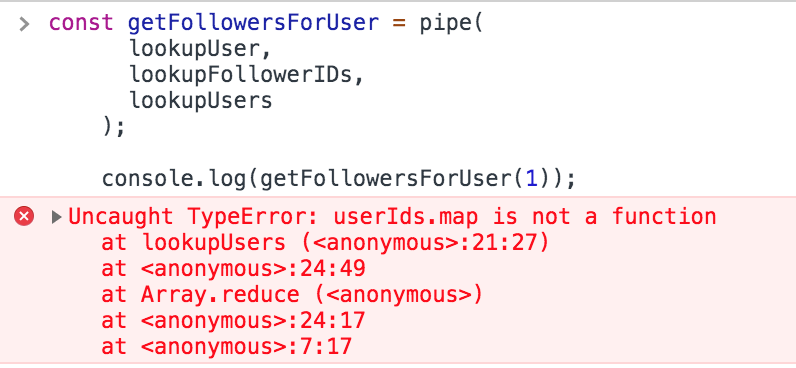

_Promise Series Transformed into Composable Promises!_

How to execute Promise Series using Composable Promises rather than Promise Chaining or Async/Await — When functions can be composed, Promises can be composed too! — Leveraging reduce() and Closure

## Use Case

Assume we have a database of users in the following format.

```jsx
const db = {
  users: {
    1: {
      name: "Ethan Hunt",
      followerIDs: [2, 3],
    },
    2: {
      name: "James Bond",
      followerIDs: [1, 3],
    },
    3: {
      name: "Jason Bourne",
      followerIDs: [1, 2],
    },
  },
}
```

**Problem Statement: **Given an `userId` , return an array of the user’s followers.

Even though the above-mentioned database is a simple object, let’s assume the required data has to be fetched by a collection of promises.

```jsx
const lookupUser = userId => Promise.resolve(db.users[userId])
const lookupFollowerIDs = user => Promise.resolve(user.followerIDs)
const lookupUsers = (userIds = []) =>
  Promise.all(userIds.map(userId => lookupUser(userId)))
```

### Promise Chaining to the rescue

One of the simplest ways is to chain the required promises to arrive at a final solution.

```jsx
lookupUser(1)
  .then(user => lookupFollowerIDs(user))
  .then(followerIDs => lookupUsers(followerIDs))
  .then(userFollowers => console.log(userFollowers))
```

Even simpler without the usage of anonymous functions,

```jsx
lookupUser(1)
  .then(lookupFollowerIDs)
  .then(lookupUsers)
  .then(userFollowers => console.log(userFollowers))
```

### Async/Await to rescue from Promise Chaining

The application of `Async/Await` to our problem made the solution even simpler and readable.

```jsx
const getFollowersForUser = async userId => {
  const user = await lookupUser(userId)
  const userFollowerIDs = await lookupFollowerIDs(user)
  const userFollowers = await lookupUsers(userFollowerIDs)

  return userFollowers
}

getFollowersForUser(1)
```

---

## Back to the Basics

Async/Await made the problem and its solution easy.

But is there any other way?

Any other way where we can compose the Promises together?
Any other way where the composed Promises can be exported like normal functions and re-used across the application. Yes, we can, using traditional Functional Composition!

Before trying to apply the Functional Composition concept, let’s re-visualize our solution in a way where the Functional Composition concept kicks in.

### Viewing with Third Eye

```jsx
lookupUser(1)
  .then(lookupFollowerIDs)
  .then(lookupUsers)
  .then(userFollowers => console.log(userFollowers))
```

The above-provided snippet can also be re-written in the form of nested promises.

```jsx
lookupUser(1).then(user =>
  lookupFollowerIDs(user).then(followerIDs =>
    lookupUsers(followerIDs).then(userFollowers => console.log(userFollowers))
  )
)
```

Let’s take a look at how arguments are passed to each Promise.

```jsx
    lookUpUser: userId -> user
    lookupFollowerIDs:    user -> followerIDs
    lookupUsers:                  followerIDs -> userFollowers
```

> ### The resolved value of a Promise is provided as an input argument to the subsequent Promise in the series.

### Correlating Nested Promises with Functional Composition

Consider a set of functions identified by `f, g`.

```jsx
    g: a -> b
    f: b -> c
```

Functional Composition in Algebra.

```jsx
f.g = f(g(x))
```

Realizing Functional Composition in JavaScript,

```jsx
const functionPipe = (f, g) => x => g(f(x))

const incrementNumber = n => n + 1
const doubleTheNumber = n => n * 2
const h = functionPipe(incrementNumber, doubleTheNumber)

h(20) //=> 42
```

How the functions are executed under the hood?

```jsx
    h(20) =>
            doubleTheNumber(
               incrementNumber(20)
            )
            =>
              doubleTheNumber(
                21
              )
              => (21*2) => 42
```

> The resultant value of the function `incrementNumber` serves as an input argument to the subsequent function `doubleTheNumber` in the series.

```jsx
    incrementNumber: number -> number
    doubleTheNumber:           number -> number
```

If N functions (N ≥ 2) are involved in the functional composition, [it can be realized using reduce()](/how-to-get-complete-leverage-from-javascript-reduce)

```jsx
const pipe = (...functions) => value =>
  functions.reduce((currValue, currFunc) => currFunc(currValue), value)
```

#### pipe() — Visualization

```jsx
    pipe(
     funcA,
     funcB,
     funcC
    )(initialArg)

    // equivalent to

    (initialArg) => funcC(
     funcB(
      funcA(
       initialArg
      )
     )
    )
```

_pipe() — Visualization_

Applying pipe() ,

```jsx
const consoleTheNumber => n => console.log(n);
const h = pipe(incrementNumber, doubleTheNumber, consoleTheNumber);
h(20); //=> 42
```

### Simulating Nested Promises with Functional Composition

As we’ve correlated nested promises with functional composition, let’s simulate the implementation of nested promises using reduce() under the hood.

```jsx
const getFollowersForUser = pipe(
  lookupUser,
  lookupFollowerIDs,
  lookupUsers
)
```

_Using pipe() to simulate nested promises is not working : (_

Let’s visualize how the piped function `getFollowersForUser(1)` will be executed.

```jsx
lookupUsers(lookupFollowerIDs(lookupUser(1)))
```

Hold-on a moment! Doesn’t it look different from the implementation of the nested promise? Yes, it is!

> ### Instead of passing resolved value to the subsequent promise in the series, the actual promise object is passed.

Because `lookupUser(1)` does not return the resolved value. It actually returns the Promise object itself.

_Promise.resolve() returns the Promise object itself. Not the resolved value!_

As a result, `lookupFollowerIDs` will receive a Promise object rather than `db.user` object.

As per the definition, `lookupFollowerIDs` will run `promiseObject.followerIDs` rather than `user.followerIDs` which will return `undefined`

Consequently, the last function in the series `lookUpUsers: (userIds = [])` will receive `undefined` rather than an array of `userIds` . This logical conclusion fits with the error we got when promises are composed using `pipe()`

```jsx
Uncaught TypeError: userIds.map is not a function
```

**Solution — **Programmatically chain the promises using `thenable` and `reduce()`

## Sequential Promises As Closure + Functional Composition

Consider the chained snippet we’ve created earlier.

```jsx
lookupUser(1)
  .then(lookupFollowerIDs)
  .then(lookupUsers)
  .then(userFollowers => console.log(userFollowers))
```

This can also be re-written as,

```jsx
const promise1 = lookupUser(1).then(lookupFollowerIDs)

const promise2 = promise1.then(lookupUsers)

promise2.then(userFollowers => console.log(userFollowers))
```

As you may have noticed, at any given statement, a Promise object is chained with another Promise using `then()` .

To implement this logic programmatically, as an initial step, a function can be created which receives two Promises and chain them using `then()`

```jsx
const internalPromisePipe = (f, g) =>
  function() {
    var ctx = this
    return f.call(ctx, ...arguments).then(function(resolvedV) {
      return g.call(ctx, resolvedV)
    })
  }
```

#### Why using call method to invoke Promise-returning functions?

Preserving reference to `this` — Promise fulfilling function does not have access to `this` context as it creates its own context. Trying to use `this` without binding the context will result in *Uncaught Reference Error. *The `call` function invokes the argument function with provided `this` value (`ctx` in our case)

### Applying promiseChainer() in pipe()

```jsx
const promisePipe = (...functions) => (...initialArgs) => {
  return functions
    .reduce((currFunc, nextFunc) => {
      return promiseChainer(currFunc, nextFunc)
    })
    .call(this, ...initialArgs)
}
```

Let’s apply `promisePipe` to our problem.

```jsx
const userId = 1

const getFollowersForUser = promisePipe(
  lookupUser,
  lookupFollowerIDs,
  lookupUsers
)

getFollowersForUser(userId).then(userFollowers => {
  console.log(userFollowers)
})
```

#### Breaking down the logic — promisePipe() Call

Iteration 1

```jsx
  currFunc: lookupUser
  nextFunc: lookupFollowerIDs

  internalPromisePipe(f: lookupUser, g: lookupFollowerIDs)

  // Returns =>

  function() {
    var ctx = this;

    return lookupUser.call(
      ctx, ...arguments
    ).then(function(resolvedV) {
      return lookupFollowerIDs.call(ctx, resolvedV);
    });
  };
```

Iteration 2

```jsx
  currFunc: internalPromisePipe(lookupUser, lookupFollowerIDs)
  nextFunc: lookupUsers

  internalPromisePipe(
    f: internalPromisePipe(lookupUser, lookupFollowerIDs),
    g: lookupUsers
  )

  function() {
    var ctx = this;

    return internalPromisePipe(lookupUser, lookupFollowerIDs).call(
      ctx, ...arguments
    ).then(function(resolvedV) {
      return lookupUsers.call(ctx, resolvedV);
    });
  };
```

Breaking down the anonymous function returned by the second iteration will provide us the required implementation of nested promises.

```jsx
  function() {
    var ctx = this;

    return (
      function() {
        var ctx = this;

        return lookupUser.call(
          ctx, ...arguments
        ).then(function(resolvedV) {
          return lookupFollowerIDs.call(ctx, resolvedV);
        });
      }.call(
        ctx, ...arguments
      ).then(function(resolvedV) {
        return lookupUsers.call(ctx, resolvedV);
      })
    );
  };
```

**Inner functions involved in `internalPromisePipe()` retains the corresponding values of `f` and `g` due to closures.**

```jsx
promisePipe(lookupUser, lookupFollowerIDs, lookupUsers)(userId)
```

The above snippet can be roughly translated into the Promise Chaining, we’ve created manually during the initial phase.

```jsx
return lookupUser
  .call(ctx, userId)
  .then(function(resolvedV) {
    return lookupFollowerIDs.call(ctx, resolvedV)
  })
  .then(function(resolvedV) {
    return lookupUsers.call(ctx, resolvedV)
  })
```

---

## Composable Promises!

Consider you’re working in a Node.js backend application with MongoDB as the database. Assume, for every request, you’ve to

1. Fetch the current user from the Database
2. Fetch the user’s roles
3. Fetch the Permissions belonging to the roles

And at last, Authorize Actions based on the permissions provided to the user.

But Data Fetching in MongoDB is asynchronous where callbacks or promises have to be used. Assume we’re using Promises. It can be composed in the following manner.

```jsx
const getCurrentUser = promisePipe(getDatabaseConnection, getUserFromCookies)

const getCurrentUserRoles = promisePipe(getCurrentUser, getUserRoles)

const getCurrentUserPermissions = promisePipe(
  getCurrentUserRoles,
  getPermissionsFromRoles
)
```

Anywhere in the application, if the current user has to be retrieved, all one has to do is, simply import `getCurrentUser`. All the functionalities are decomposed into individual functions and composed together as per the requirements — Core of the JavaScript Functional Programming!

After using this Composable Promises Concept, I promised myself I won’t handle Sequential Promises in any other way : )

> ## Functional “Composition” played in the JavaScript Piano with reduce() calling all the tunes!

---

### Manifestations of Love towards reduce()

- [Composable Functions Using reduce()](/how-to-get-complete-leverage-from-javascript-reduce)
- [Efficient Array Processing with Transducers built using reduce()](/how-to-efficiently-operate-on-large-datasets-using-transducers-in-javascript)

This blog post is inspired by [Ramda#pipeP](https://ramdajs.com/docs/#pipeP) :)
