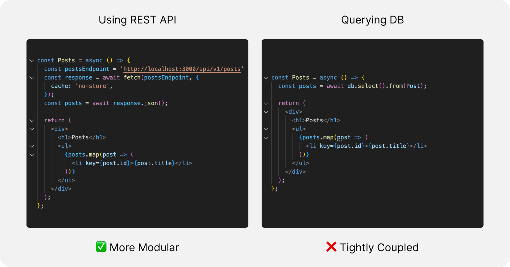

With Next.js, creating and deploying a single-page app (SPA) with React server-side rendering (SSR) has become effortless. Many people use React SSR in their new projects, but it doesn’t always make sense, and there are pitfalls.

Here are some considerations when using SSR:

**Loose Coupling:** SSR can improve developer productivity, but there are pitfalls. If you are building an application from scratch, you may be tempted to make database requests from React Server Components since many popular frameworks support it. This can be the fastest way to launch an MVP and get the product in your customers’ hands. And if that’s your goal, then go for it.

But suppose you are planning to build a more sophisticated web app that is expected to last several years and several development iterations. I will consider setting up a REST API and making requests for it instead of directly querying the database from React Components. This will make the code more modular and reusable. The front-end and REST API can be deployed and scaled independently. As the team grows, it will be easier to separate concerns, and backend engineers can work on the API and the backend services, while the front-end engineers can work on React, and full-stack engineers can work on both.

**Search Engine Optimization (SEO):** SSR is considered a best practice if you want your pages easily indexed by Google and other search engines. Although Googlebot can handle client-side javascript very well, other crawlers may not have advanced javascript rendering capabilities. Given that many people flock to Generative AI for searches these days, you should include all crawl bots. So, SSR still has an edge over client-side rendering (CSR).

If you are building SaaS, you don’t need SSR for SEO on the logged-in pages, and the marketing department usually manages the external pages. They would prefer Framer, WebFlow, or WordPress over React so that they can release new pages without depending on developers.

However, if you are not building SaaS and your application requires SEO (For Example, eCommerce, discussion forums, Info sites, etc.), then SSR makes sense. But it would help if you also considered using an off-the-shelf solution like Shopify for eCommerce, Discourse for discussion forums, or WordPress for Info Sites, and only consider React if off-the-shelf solutions don’t work.

**Conclusion**

So, limiting React SSR to only being able to make HTTP API requests is a great way to make your code modular and separate concerns.

Moreover, you can leverage any of the several edge networks to host your front-end code close to your user's physical location and improve the latency and Time To First Byte (TTFB). That’s because these edge networks allow HTTP requests but don’t allow installing native libraries required to make database calls.

*This post is authored by <a href="https://shivdeepak.com/" target="_blank">Shiv Deepak Muddada</a> and peer-reviewed by <a href="https://codeanand.com/" target="_blank">Anand Narayan</a> and <a href="https://www.linkedin.com/in/yadavsudhanshu/" target="_blank">Sudhanshu Yadav</a>.*
