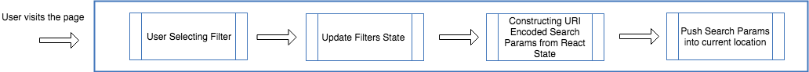
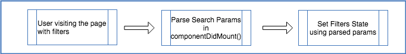

It’s been long gone where the websites reload every single time whenever the user apply search filters. With React started dominating the frontend world, complex logic once resided in the backend, can now be solved in frontend with ease.

Using React, search functionality can be implemented with simple JavaScript functions. Data will be filtered and displayed instantly, that too without any page reload.

But, there are a few common issues that we all face in some stage of React application development. Assume you’re building an e-commerce site which lets the end-user to filter the clothing by following most commonly used attributes

- Brand
- Color
- Price

The user has applied filters in all attributes to view suitable products. Here’s the major problem statement:

> Whenever the user reloads (or) revisits the page, React state will be lost and hence, all the applied filters too. How to retain filter data even after a page refresh?

How this problem can be solved?

## window.localStorage

### Before reload

There are two scenarios to be handled.

- When the component is unmounted — Set data in localStorage with component’s state in componentWillUnmount()
- When the page is reloaded (componentWillUnmount() won’t be triggered in this case) — Register a listener on the beforeunload() which will store the component’s state in localStorage.

### After reload

Fetch data from localStorage and set in the component’s state using componentDidMount()

```jsx
saveStateToLocalStorage() {
  // for every item in React state
  for (let key in this.state) {
    // save to localStorage
    localStorage.setItem(key, JSON.stringify(this.state[key]));
  }
}

componentDidMount() {
    this.hydrateStateWithLocalStorage();

    // add event listener to save state to localStorage
    // when user leaves/refreshes the page
    window.addEventListener(
      "beforeunload",
      this.saveStateToLocalStorage.bind(this)
    );
}

componentWillUnmount() {
    window.removeEventListener(
      "beforeunload",
      this.saveStateToLocalStorage.bind(this)
    );

    // saves if component has a chance to unmount
    this.saveStateToLocalStorage();
}
```

## Redux Persist

A [library](https://github.com/rt2zz/redux-persist) to persist and rehydrate a redux store. It also uses browser storage under the hood. Redux integration is required to use this library.

---

## Campaign Problem

Assume the client is coming up with the following problem statement,

> Each group of customers are interested in certain brands and price range. To reach the customers better, I am going to run a campaign for every customers’ group. I need a unique URL for every individual campaign which displays only the products related to that campaign.

Can we design a simple approach which will,

1. Persist/Retain UI State across browser sessions?
2. And also solve the Campaign problem without creating unique base URLs every single time?

### Solution — URL Search Parameters

As a single base URL will be used for all campaigns, we have to send filter data along with URL in some format. And we will be using URL Search Parameters to include filter data in URL.

The following libraries are used in this approach.

- [history](https://github.com/ReactTraining/history) — API to manage session history
- [qs](https://github.com/ljharb/qs) — Convert React state objects into URI encoded strings and vice-versa

#### Dual Cases

1. Whenever the user applies any filter, URL Search Params should be updated alongside React State.
2. Whenever the user visits a URL with filter params, React State should be updated to reflect filter data.

#### Part 1 — Syncing Search Params with React State



1. Whenever the user applied any filter, the component state will be updated with filter attributes.
2. Based on updated filter attributes, the corresponding URI encoded string will be generated. (As URL do not support objects/arrays)
3. URI encoded string will be added to URL using history library.

```jsx
import qs from "qs";
import _ from "lodash";
import { createBrowserHistory } from "history";


constructor(props){
  super(props);
  this.state = {
    products: [],
    filters: {}
  };
  this.history = createBrowserHistory();
}

handleFilterUpdate = (attrName, attrValues) => {
  const { filters } = this.state;
  this.setState(
    {
      filters: {
        ...filters,
        [attrName]: attrValues
      }
    },
    () => {
      this.syncFiltersWithURL();
      this.setProducts();
    }
  );
};

syncFiltersWithURL = () => {
  const { filters: productFilters } = this.state;
  const stringifiedFilterParams = qs.stringify(productFilters, {
    arrayFormat: "comma"
  });

  this.history.push({
    search: `?${stringifiedFilterParams}`
  });
};

setProducts = async () => {
  const { filters: productFilters } = this.state;
  const productsResponse = await axios.get("/api/products", {
    headers: {
      Accept: "application/json"
    },
    params: {
      productFilters
    }
  });

  this.setState({
    products: productsResponse.data
  });
};
```

#### Part 2 — Syncing React State with URL Search Params



1. Whenever a URL with search params is visited, corresponding React component will parse data from the search params.
2. From parsed filter data, the component will update the state (usually in componentDidMount()).
3. Based on state change, UI will be updated accordingly (showing pre-filtered campaign products)

```jsx
componentDidMount = async () => {
  // Parse Params and set Filters
  const filterParams = this.history.location.search.substr(1)
  const filtersFromParams = qs.parse(filterParams, { comma: true })

  this.setState(
    {
      filters: filtersFromParams,
    },
    this.setProducts
  )
}
```

Try this out in a sandbox environment with a sample working code.

<iframe src="https://codesandbox.io/embed/browserhistory-with-search-params-2dech?fontsize=14" title="BrowserHistory with Search Params" allow="geolocation; microphone; camera; midi; vr; accelerometer; gyroscope; payment; ambient-light-sensor; encrypted-media; usb" style="width:100%; height:500px; border:0; border-radius: 4px; overflow:hidden;" sandbox="allow-modals allow-forms allow-popups allow-scripts allow-same-origin"></iframe>

#### Pros

1. Custom URLs can be designed and used in promotional emails without any hassle.
2. As URL always reflects UI state, clicking back and forth in the browser will simulate the latest user interaction. This will enhance the user experience. (Assume the user is selecting Nike brand and grey color, clicking back will de-select the grey color)

#### Cons

1. Too many filters can make the URL unreadable.
2. May not be suitable for complex filters.

---

If you’re building a single page React application which requires a simple filter functionality, Search Params Syncing with React State will be the easier option. Local Storage can be adopted when the filter becomes complex in terms of nested level and values. For react-native applications which stores user preferences and data in complex JS format, redux-persist can be a better option.

The primary purpose of adopting Search Params approach is to illustrate how simply a given problem can be solved without changing the existing architecture or by adding new heavy-weight libraries.

### Further References

- [React Router](https://reacttraining.com/react-router/web/guides/quick-start)
- [History API](https://developer.mozilla.org/en-US/docs/Web/API/History_API)
