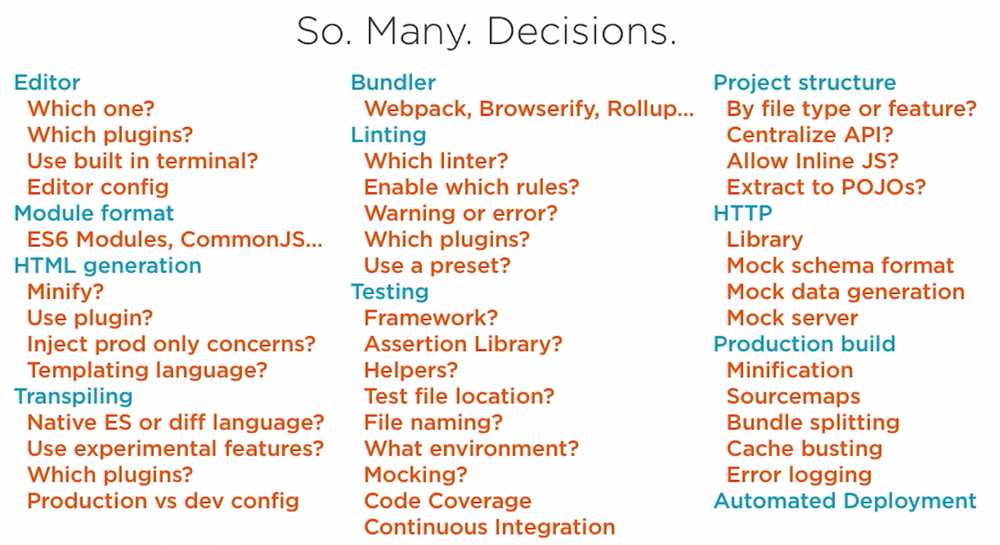
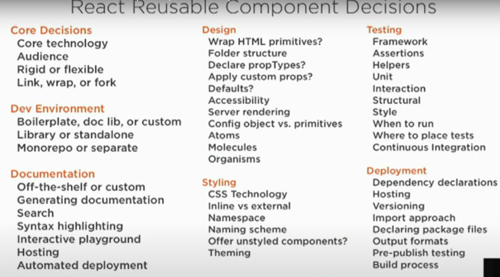

Most software applications have two major components, the backend and the frontend.  Backend contains the business logic. Frontend contains the user interface. The user interface could be a mobile app or a browser app.

If you are building for the browser or mobile, you can use choose to write your frontend in React / React Native. Once you choose React, you need to put together a well composed team to build.

### Requirements for a successful ReactJS project

To put together a team, it is important to understand the tasks at hand to build a react frontend. The First major task is to take the architecture/design decisions. According to Cory House, there are 50 such design decisions to make for a react codebase like.

1. Hooks vs Classes
2. Which CSS patterns to follow
3. Dev Environment, linter rules
4. Type System and many more
5. Which bundler to use
6. Project style structure
7. Which tasting framework to use.

Image credits to Cory House

Each of these decisions, requires weighing the tradeoffs for your particular project. For example, If your designers are working out of tailwind themes. It might be wiser to use tailwind css than styled components for your particular case.

### Frontend Architect / Lead

To make these kind of architecture decisions you need a Frontend Architect / Lead. Who has been a senior developers on at least 3 react, production ready, live projects. From their experience they will know the trade offs each of these options carry. The trade offs might not be technical. They could be logistical trade offs like developer availability. You might not have enough "flow" developers to hire, though it might be a better framework for your project. This person can do code reviews as well, and should have decent view of the solution/codebase at any time.

### 5 Steps to building a frontend in React

Now that you have the design decisions taken. It's time for implementation. The Facebook team breaks down implementation in react to 5 steps. From their  [Thinking in React](https://reactjs.org/docs/thinking-in-react.html) article.  

Step 1: Break The UI Into A Component Hierarchy

Step 2: Build A Static Version in React

Step 3: Minimal (complete) representation of UI State

Step 4: Identify where the state should live

Step 5: Inverse Data Flow

In simpler words

The First three steps are taking the UI mocks and building components. The last two steps are making the components work together to build the app.

### "Front & Back" of the Frontend

Brad Frost, calls  the UI components front of the frontend. The state management and API tying up are the back of the frontend. 

The **front of the frontend developer** handles the look and feel of the component. They are good with CSS. They are responsible for reusable components, design tokens, design libraries, cross browser, accessibility, documentation for the components. They make these react components composable so that other react components can use them . They write good types and test cases for these components so that other developers can build and edit these components. These components are the building blocks for our website and it is crucial that they are maintainable.

The **back of the frontend developer** ties up all the components. Passes up the state, handles routing, authentication, caching, and communication with the server. They are good with javascript. They uses appropriate components from the design system provided by the front of the backend developer. Or request components when required. He should be able to write javascript code  such that it runs on primitive mobile devices as well.

A lot of the logic is being shift to the front end. If the javascript code is not written with primitive devices in mind, it will suffer from poor usability and sluggishness. They also write the required bundler configurations and deployment infrastructure configurations.

They should have very good communication skills as they are the bridge between the API and the frontend components. They will communicate with the frontend developer and the backend server logic developers. This is the bottleneck of every project, one team ends up blaming the other, and work gets stifled. It is crucial that the developer is pro-active, and works against mock api. This pushes the teams to stick to the API contracts and good practices.

This developer does step 4 and 5 of the thinking in react. They put together a working application, and deploy this to staging. It is also important that he writes the integration tests and unit tests for the tying up logic he has written. Though his work might be behind the scenes type of work, they are the crucial glue that holds everything together. Thereby making the app function smooth.

### Building a reusable React UI Component library

image credits to Cory House

Frontend developers should improve and stay in trend with the ever changing landscape. Component design, and reusable module design philosophy about how rigid or flexible the APIs cannot be decided by the frontend lead and implemented by the developers. The developers are a tasteful and crucial entity of the team, and they impact the codebase. There a many localised decisions they take like the ones below

1. API rigid or flexible
2. Defaults
3. Testing style etc

The lead, front of the frontend and back of the frontend developers form a nice structure. The team can scale and build solid frontend applications. While you can get one developer to do it all, it is difficult for them to focus on each aspect like a specialist would. It would show up in how the codebase grows. The components built by the front of the frontend developers should be used through various modules.

## React Team Structure

### The problem with structuring teams based on business modules

Generally CTOs tend to structure their team based on modules. Like for instance take an e commerce app. One approach would be to have a team for inventory management app, one for billing, etc. . The disadvantage with this is, teams would be building in silos, and a lot of work would be repeated and redone. Think about building the same Text Box, and Form components again and again

### Structure based on Work Technicality

The other approach would be to structure the team based on technology work. like the one this article recommends. To have a Lead take the design decisions. The front of the frontend developer do the look and feel components. The back of the frontend do the tying up and functionality. This way there can be reuse across the entire software spectrum within the company. The best code is the code which is not written, as it is easier to manage, less bugs etc.

This makes a team unit comprised of at least 3 developers. But this is scalable, and a single team unit can produce more software. As the scope of the work increases, more developers and leads, can be added to the same structure. You can add many front of the frontend developers. They can take care of react and react native. They can focus on more deeper niches, like working on bridges for iOS and android. They can work on accessibility, performance of components. Build animation and transition components for your design system. This makes your reusable components  stronger. It is a great infrastructure investment for your company in the long run as well. The back of the backend developers could focus on API integration, authentication, routing, building an ORM kinda layer on the frontend for CRUD features etc.

The only place you would want to structure team based on business modules is the back of the frontend developer. To tie with the API of the backend. As this is the only business logic dependent work. You can add more Leads to your team. They can split code reviews, Infrastructure, Design system, production build responsibilities. The team structure proposed can work for startups to large corporations.

### Increasing responsibilities of a frontend developer

A few years back, we had a full stack developer. The server was rendering the html and the frontend javascript was doing very little. It did only the UI interactivity, like clicking , validation, etc. . After the onset of jQuery and early JS frameworks, we have the frontend and the backend divide. Teams hired PHP developers to build the backend. Javascript developers to build the frontend. Slowly javascript started eating the world. In 2007 Jeff Atwood, the co founder of StackOverflow, made the famous quote “Any application that can be written in JavaScript, will eventually be written in JavaScript.”

Large corporations like Google and Facebook started building their own frontend frameworks like AngularJS and ReactJS. A lot of functionality was pushed from the server to the client side. The server moved from sending markup to JSON. The frontend javascript frameworks did the templating, routing, authentication etc. . But the JDs did not reflect this, the frontend developer was being tasked with all of this. It's time we have a back and front for the frontend itself. And an architect specialised to take these 50 decisions that comes with setting up a frontend project. Today javascript has evolved so much that we have languages that compile down to javascript. Like Rescript and Typescript. It is a very specialised world which needs experts.

### Leveraging Third Party React Design Systems

Many apps today have the same set of components like Navigation, header, footer, etc. . If you do not have a lot of custom UI. Your design team and lead might want to pick up a third party open source design system like Chakra UI or TailwindUI. This considerable reduces the load on the front of the frontend developer, and saves time for you. They might have to take the design system and change the tokens to suit your brand. This this will eliminate a lot of work for you. Bugs and maintenance are now offloaded to the open source design system itself. Your team can help contribute and maintain the open source system. This also opens up opportunities like hiring contractors who maintain and specialise in these open source libraries. This opens up your access to talent pools as well. You can ask the developer to show examples of how they have customised the design system for other brands. This can give a good idea of this approach will work for you. If that is not available, try to build a small page in that approach before you dive full on in. Once you get this right, you get a lot of leverage in prototyping and validating new ideas for your business. As this makes step 1 and step 2 of thinking in react achievable fast. You get a static version of your idea almost in no time. You can put in sample data and give shape to your ideas and test them out.

### React State management

The back of the frontend developer spends bulk of the time dealing with state management, tying the components up, routing the various pages and connecting the server backend APIs. There are several ways to tackle the above. Standard and non standard practices each have their pros and cons. It is the job of the Lead to choose what works best for you. Based on your time and engineering constraints, you can choose. Flow, XState, are some standard state management methodologies, which you can look for while hiring. Several new methodologies have sprung up as well, like Facebook's  Recoil. The ecosystem is mature. If you choose a standard approach, you get more developers who are familiar with it. Newer approaches tend to be more sleeker and dev friendlier. We at Codebrahma use React Router for routing.  This has served us pretty well.

Connecting and talking to the backend has many methods which couples with the state management techniques you use. I will talk about this in depth in another article later. For now, i will list the approaches. If you are using redux, redux thunk, sagas are approaches available. Observables are another option. If you are connecting with GraphQL , relay is an option, which does a lot of the heavy lifting for you. For REST APIs you have options like [SWR and ReactQuery](https://codebrahma.com/difference-between-swr-and-react-query) which we have studied in detail about. The choice for this simplifies down to how your backend is engineered. Graphql, REST, your api endpoints and documentation are crucial parameters to make this choice. If you have a Graphql backend, you get a lot of tooling for free on the frontend. And you can look for this specific skill when you hire. The more specific your requirements are, the easier it is for you to locate that talent, or source the solution. Good planning achieves a lot 🙂

### Front of the FE skills

Ideally the tech lead is someone you hire first. They they come up with the most of the decisions. And help you narrow down your search for the front & back of the frontend team. For example if your design team has chosen TailwindUI components to design with. Then you look for developers who have built tailwind open source components. That makes the interviewing process simple and specific. You know that this person can do the job pretty well, since you have already seen his work. For the **interview process** you can ask him to build a standard page like e-commerce search results page, that reflects your branding. They can then use the solution as a template on their Github page. The tech lead can look at the component structure, naming, api usage, prop handling, local state management, accessibility etc. to access the performance of the candidate.

One might also want to test for fundamental DOM and JS knowledge. Basics like event management, event bubbling, DOM Tree events, how the Virtual DOM works, react synthetic events are crucial. You want to hire someone who wants what happens under the hood as well. This way they can make informed decisions when required. Hiring someone who can simply put together a tailwind page will work in the short run. As the codebase grows in size, you will start hitting performance issues and sluggishness, because of using many libraries and not worrying about bundle-sizes etc. . A person who knows what works under the hood can easily maneuver such issues.

### Back of the FE skills

This developer is going to be working with your backend server team a lot. If you are using Graphql you might want to go with some one who has experience with relay or prisma and the likes. If you are using REST api format you might want SWR, ReactQuery, Redux experience. You can present a simple job listing page, and ask  to perform CRUD. You can test how they manage state and connect various components. How they handle caching and authentication. Look at code quality. If they are looping or using maps. How readable the code is. There is no right answer. This is a matter of taste. You want someone with solid javascript fundamentals. Who understands types, asynchronous programming, promises, how async await works etc.  

### Tech Lead / Architect

Crucial decision maker. You want to look for someone who has built at least 3-4 production live applications. You might want to ask about how they architected and solve challenges in their previous gigs. You might want to quickly quiz them on hands on code, if you want someone hands on. This person should be your first hire and most crucial one.

### ReactJS contractors

If you are looking for specific talent like TailwindUI, ChakraUI, Relay, etc. , hiring react developers as contractors is a great option.They typically have worked on more projects thanks to the nature of the job. They have worked in consulting shops that build many projects, and get exposure to many toolsets. They can be great additions to your frontend team. If you are working with a consulting boutique they can help you scale your team faster as well, compared to the conventional method of hiring. 

### ReactJS Full Time Employee

Hiring a strong frontend developer to your team is an asset. It might take a little longer to hire the developer, and get them onboarded. Once onboarded employees are more invested to your brand and vision of your firm. They contribute in more than one ways, and more than solving the specific task at hand. When you hire full time employees, they might not necessarily have the skill set that you are application requires. They might need training on the tools that your company uses. Hence most companies they their own bootcamp programs or an onboarding process

Choosing a FTE or a contractor model is a function of the CTOs thought process. In our experience we have seen the full spectrum on this. We have worked with unicorn CTOs who have outsourced the entire frontend. And we have seen 2 person startups mention explicitly that they are not looking for contractors in their JDs. Each approach has it pros and cons.

Typically engineers with Computer Science education and FAANG backgrounds are strong with algorithms and system. They are not very experienced in knowing the nuances in building for mobile or the browser. They want a team to quickly pickup the designs from the design team and convert them to working apps that speak with their backend. At this point some teams have the luxury of time and a couple of quarters, to hire and put together a team.

Some CTOs prefer to work with a consulting company to do the work. They periodically go through the codebase, and understand the internals. If they are comfortable with this methodology they stick with this approach, else they hire their team in parallel and transfer. We have had both types of clients; some have been working with us till date, and some have moved on.

### Conclusion

We see that a lot of code has shifted to the client side. We recommend that you hire 3 types of specialised developers for your team. Frontend Tech Leads, Front of the frontend developer and Back of the frontend developer. With specific skillsets it is easier to identify the right candidate, and you get more leverage from a small team. This structure can scale. Choose your design systems and tools wisely, and you can offload a lot of your codebase to open source tools. FTEs or Contractors, when identified correctly, both can get the job done.
