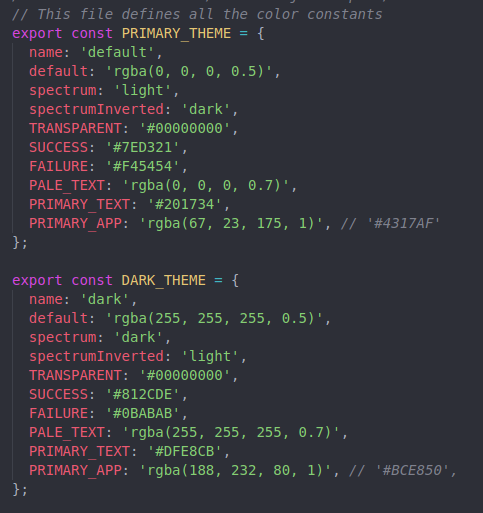
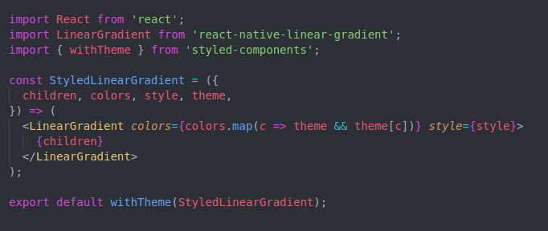

With mobile phones taking their place by us at all times, it’s important to let the users choose a theme that’s comfortable for them, or at the least provide a dark theme so they do not have to strain their eyes in the low light environments.


This article will use [styled-components](https://github.com/styled-components/styled-components) and [react-redux](https://github.com/reduxjs/react-redux). These libraries will let the app access the theme object from anywhere. Writing a non-redux solution is just as simple. You would instead be required to use React’s context API.

*Before we begin, this method works well when you’re starting an app from scratch and do this at the start. While it is still a good way to approach the problem it might require quite a bit of refactoring if your codebase is already considerably large.*

##  Define your color constants

Let’s start with the simple stuff. We shall have two themes for the user to pick from. I shall start with a way to approach this and then provide alternatives.

 *Color constants file*

Create objects corresponding to each them and let each property in the object be a color in the theme. You can also drop in some meta-data associated with the theme. I have a key called *spectrum* and *spectrumInverted* in my theme color files. I use these constants to set the StatusBar icon colors.

```js
  <StatusBar
    backgroundColor={theme.PRIMARY_BACKGROUND}
    barStyle={`${theme.spectrumInverted}-content`} // light-content
  />
```

## Get colors into your app

Now that you have some colors, the next step is to actually get them into your app so that the components can make use of them. The simplest way is to probably maintain a color name and then import all your colors and conditionally choose between the theme color constants. This would be a lot of duplicate code, however!

For starters, let’s use redux and load the default theme into the store.

```js
import  { PRIMARY_THEME, DARK_THEME } from 'styles/theme-default';

const initialState = { theme: PRIMARY_THEME };

export default (state = initialState, action) => {
  switch(action.type) {
    /*
      reducer functions that match action types go here
    */
  }

  default:
    return state
}
```

We do not have any reducer functions but we do have an initial state and our default theme object is being loaded!

Now we get the theme object constant at the root level of our app. Since we use redux we’ll do it right inside our *Provider*.

```js
  import { connect } from 'react-redux';
  import { ThemeProvider } from 'styled-components';

  const RootComponent = ({ app }) => (
    <Provider store={store}>
      <ThemeProvider theme={theme}>
        {/* app router / all other components*/}
      </ThemeProvider>
    </Provider>
  );

  export default connect(({ app }) => ({ app }))(RootComponent);
```

I recommend you do a little reading on how redux works if some terminology is not super clear. I’ve imported *connect* which will let me access my redux store from inside my component. In connect I gain access to my *app* reducer, which holds my theme object, under the key **theme**! Also I’ve imported something else called the *ThemeProvider*.
> If you’re going the non-redux route (which I will not dive deep into) you might want to have a similar **Provider** component here with a local state that holds the current theme and a function that manipulates the local state. This function will be called whenever the user changes themes. So we shall be getting the theme from the local state instead of the redux store. The context **Consumer** will use the function passed down to manipulate the theme in some other place like the Settings page.

*ThemeProvider* takes a prop called *theme* which is going to determine what the current theme is. If you want to change the theme, all you have to do is pass a different variable down as the theme prop.

## Design Components to use Colors

The next step is to write some base components that will be used across the app. You might want to create styled-component versions of **View** and **Text**. It would also make sense to have these components styled.

- StatusBar
- Button
- Icon
- TextInput

Anything else is most likely a mixture of the above and as such do not require their own base component.

```js
import styled from 'styled-components';

export default styled.View`
    background-color: ${(props) => props.theme[props.backgroundColor] || props.theme.TRANSPARENT};
    border-color: ${props => props.theme[props.borderColor] || props.theme.TRANSPARENT};
`;
```

When this is ready, you can import *StyledView* anywhere inside your app as long as it’s inside the *ThemeProvider* component. It should have access to the theme object. Invoking it is simple and works as below:

```js
  <StyledView backgroundColor="PRIMARY_BACKGROUND">
    {/*content*/}
  </StyledView>
```

There we have it! Our first completely themed component. Anywhere where you’d normally use *View*, you might want to use *StyledView* now. Unless, the View doesn’t have any theme based coloring going on. It’s best to have these base components as clutter-free as possible and keep props to a minimum. Unless you see something being used everywhere (that doesn’t have to do with colors), it’s best left to the local styles of that component.
> If a particular style isn’t showing up, play around with the order of the props you’re passing to the styled components. Make sure style isn’t overriding anything that it shouldn’t be.

With that, you should be able to theme all your components. Some of them do not have a native styled component. For instance, to use our theme colors with a third-party component such as *LinearGradient, *the construction goes as follows:

 *StyledLinearGradient using withTheme*


We import the *withTheme* HOC and wrap it around our component. This gives access to the theme object as long as we are within confines of the *ThemeProvider*.

## What’s Next

I’m going to list a few things I do to keep things compact and clean.

### Generic color names

Colors names shouldn’t be *Purple* or *Blue* since they might not be that when you are using a different version of the theme. Generic names based on where they are used such as *white* being called *PRIMARY_BACKGROUND* works. If you find something else that works better for you, go for it and don’t forget to leave a comment!

### Watch out for opacity

Sometimes you might want a color. Then you might want the same color but with a lower opacity. Then maybe an even lower opacity. This paves way for namespace pollution with multiple names and your files grows bigger. You can manage this by having a function within your styled-components that manipulates the opacity value before applying it.

```js
  const OPACITY_REGEX = /^([A-Z_]*)\.(\d+)$/;

  const backgroundColor = ({ theme, backgroundColor }) => {
    if (!backgroundColor) return theme.TRANSPARENT;

    const hasOpacity = backgroundColor.match(OPACITY_REGEX);

    if (!hasOpacity) return theme[backgroundColor] || theme.TRANSPARENT;

    const color = theme[hasOpacity[1]];
    return color.replace('1)', `0.${hasOpacity[2]})`);
  };

  // usage
  <StyledView backgroundColor="PRIMARY_APP.85" />
```

For this to work your theme colors should have colors as *rgba *strings.

### Dynamically generate colors

You could define a set of base colors and then run these colors through a function with an offset to generate new colors for dynamic themeing. Although how good this might look might be a question that only users can answer, it might work with some apps.

### Don’t overtheme

Aside from the base components, it’s usually a good idea to just use *withTheme* and theme the components that require them. When you start seeing the same component being themed in multiple places with *withTheme*, that might be when you might want to consider separating it into a separate themed component.

I’d love to hear of other ways that you might have used to theme your components. Leave a comment below!
