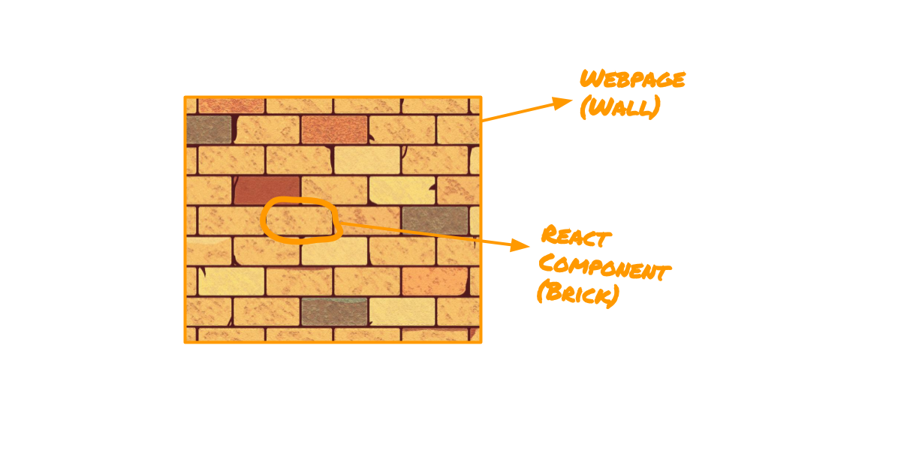
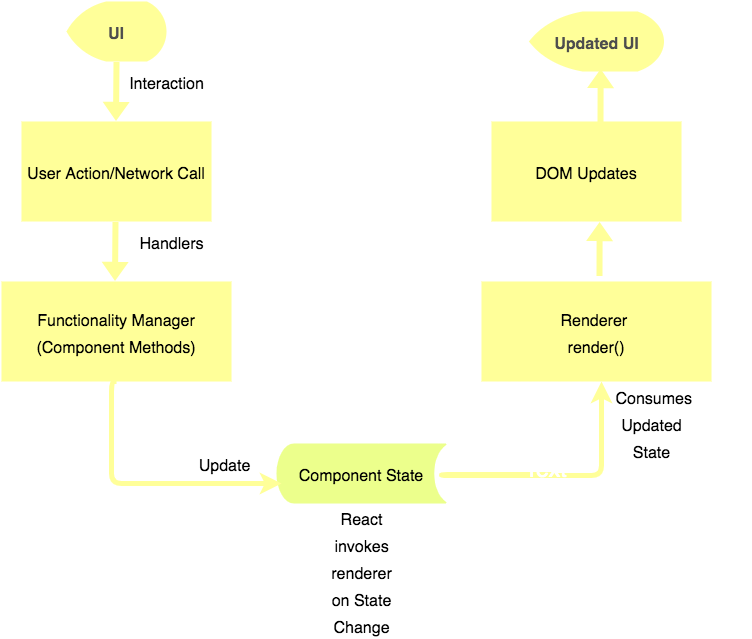
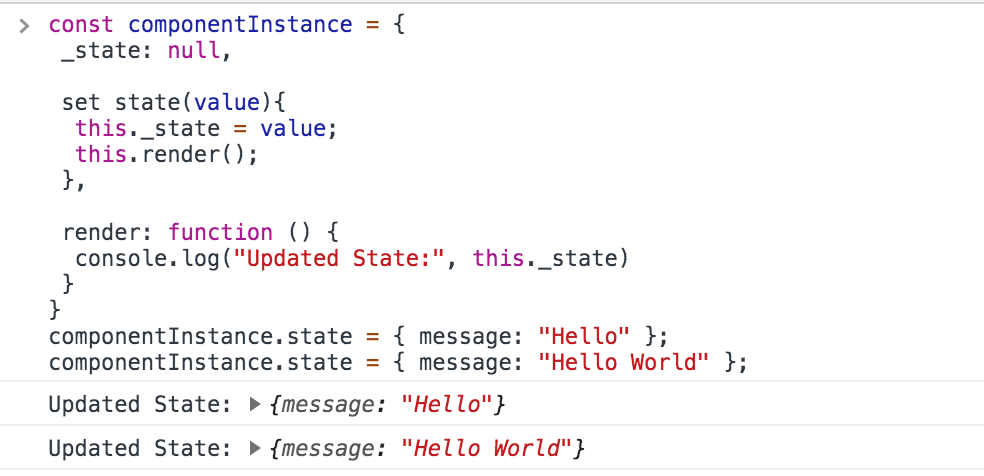
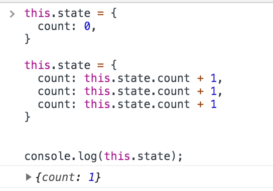
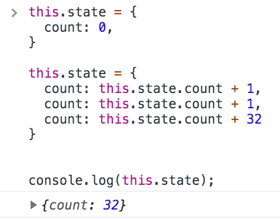

_A webpage as a collection of React Components and a Component as an implementation of Functionality and UI with State as a medium_

## Why Components

Imagine you have to build a wall of a hundred feet dimensions. You can start feeling overwhelmed on how it’s going to span out before even you start.

Instead, you can focus on laying brick one by one. One after the other. Once you’ve laid all the required bricks, you would be standing in front of a magnificent wall built by you!

Visualize the wall you built, as a single complex webpage and every single brick you laid, as a React Component.

React Components aids you to visualize complex UI as a collection of independent and reusable bricks. Rather than focusing on an entire complex UI, you can focus on implementing each Component in isolation. Once all the required components are implemented, they can be connected to form the desired webpage (UI).

## Why State in Component

Assume a simple webpage with a button having the following business logic

1. When the button is clicked, the webpage should show a spinner and fetch data from a URL.
2. When the data is fetched, the spinner should be hidden and fetched data should be displayed.

<iframe height="448" style="width: 100%;" scrolling="no" title="React - Display API Data With Spinner" src="https://codepen.io/kalidasm/embed/RwNXQxw?height=448&theme-id=dark&default-tab=js,result" frameborder="no" allowtransparency="true" allowfullscreen="true">
  See the Pen <a href='https://codepen.io/kalidasm/pen/RwNXQxw'>React - Display API Data With Spinner</a> by Kalidas M
  (<a href='https://codepen.io/kalidasm'>@kalidasm</a>) on <a href='https://codepen.io'>CodePen</a>.
</iframe>

#### Minimalistic version of how it can be implemented in React

```jsx
  state = {
    data: {},
    loading: false,
  }

  enableSpinner = () => {
    this.setState({
      loading: true,
    });
  }

  disableSpinner = () => {
    this.setState({
      loading: false,
    })
  }

  handleButtonClick = async (_event) => {
    this.enableSpinner();

    const apiData = await this.fetchAPIData();

    this.setState({
      data: apiData,
    }, () => {
      this.disableSpinner();
    })
  }

  render() {
    const { loading, data } = this.state;

    return (
      <body>
        {
          loading ? (
            <Spinner />
          ) : (
            <div>
              <button onClick={this.handleButtonClick} />
              {data}
            </div>
          )
        }
      </body>
    );
  }
```

Notice how the **functionality** `handleButtonClick, fetchAPIData, enableSpinner, disableSpinner` and **visual representation of the functionality** `render()` has been implemented in complete isolation inside the Component. Inside a Component, this isolated implementation of the functionality and the visual representation is made possible using State.

Based on the internal/user events such as button clicks, the Functionality Manager `handleButtonClick()` _will operate on the state_. Whenever the state has been changed, the Visual Manager `render()` will _consume the updated state and paint UI_ on the screen accordingly (re-rendering).

#### Functionality

Before initiating an API call, set the loading to true and after fetching the data, set the API Data to state and set loading to false.

#### Visual Representation (UI)

In `render()` function, when loading is true, show the spinner. When loading is false, hide the spinner, display the button and API Data.

In this way, the functionality does not need to focus on visual representation and vice-versa.

> #### Component’s State acts as a medium between Functionality Manager and Visual Manager
>
> #### A component can be viewed as a combination of functionality and visual representation. A webpage can be viewed as a collection of components.

_How State Connects Functionality and Rendering_

### Characteristics of Data which deserves State

- **Unpredictability **— When a dataset cannot be computed from other parts of the dataset and when a dataset is received from an external source.

Example: _(Name entered by the user in a Text Field)_. It’s not possible to foretell what the user is going to enter. Hence, the input from the text field deserves the Component’s State.

Another example is _API Data from our example_. The Component can never predict what data it is going to receive from the remote endpoint.

- **Changes Over Time** — When a dataset is not constant throughout. When a dataset changes its value over a period of time.

Example: _(`state.loading` from our example)_. The loading state is based on the initiation (true) and completion (false) of API Request. The value of loading state changes between false and true over a period of time.

Even though the data is predictable (true or false at any point in time), the Component can never know the exact time when the loading will be set to true (when the end-user clicks the button) and it can also never know the exact time when the loading will be set to false (when the API Request will return the response). Hence, the loading data deserves the state.

---

## Why setState()

Why we need to use `setState(newState)` function instead of changing the values by assigning the new values directly to `this.state = newState` ?

Internally, React operates on Component as a JavaScript Object. Updating the Component’s State triggers the re-rendering of the Component — Means React has to listen to the changes on `this.state` and invoke render function once the contents of `this.state` has been changed.

Is it possible to listen to the changes made in a JavaScript object key *without creating a function? — *Unfortunately, no :(

Assume there is a simple JavaScript object with a key named state . Whenever the value of `state` has been changed, a function named `render` has to be called.

> A [JavaScript Setter](https://developer.mozilla.org/en-US/docs/Web/JavaScript/Reference/Functions/set) has to be used to execute a function whenever a specific property of an object is attempted to be changed.

```javascript
const componentInstance = {
  _state: null,

  set state(value) {
    this._state = value
    this.render()
  },

  render: function() {
    console.log("Updated State:", this._state)
  },
}

componentInstance.state = { message: "Hello" }
componentInstance.state = { message: "Hello World" }
```



With this analogy, one can treat setState as an updater and listener for the changes in this.state.

Now, you may be wondering why not React define a setter so that `this.state` can be updated directly like how `componentInstance.state = {}` has been updated.

Based on the execution context, React’s `setState()` will update the state synchronously or asynchronously. Also, the React Component goes through a few [lifecycle methods](https://reactjs.org/docs/react-component.html#the-component-lifecycle) before rendering or re-rendering. Hence, let’s explore `setState()` in detail.

### Synchronous or Asynchronous — Dilemma

Let’s take a counter application example.

<iframe height="428" style="width: 100%;" scrolling="no" title="Multiple setState calls - Differential Nature" src="https://codepen.io/kalidasm/embed/BayXBzK?height=428&theme-id=dark&default-tab=js,result" frameborder="no" allowtransparency="true" allowfullscreen="true">
  See the Pen <a href='https://codepen.io/kalidasm/pen/BayXBzK'>Multiple setState calls - Differential Nature</a> by Kalidas M
  (<a href='https://codepen.io/kalidasm'>@kalidasm</a>) on <a href='https://codepen.io'>CodePen</a>.
</iframe>

```jsx
incrementCounterBy3 = () => {
  this.setState({
    count: this.state.count + 1,
  })
  this.setState({
    count: this.state.count + 1,
  })
  this.setState({
    count: this.state.count + 1,
  })
}
```

Each `setState()` is fetching the existing count in the state and increment the count by 1. As there are three `setState()` calls, the count state should be incremented by 3 (0 + 1 + 1 + 1). And that is what exactly happens with

```jsx
  componentDidMount(){
    setTimeout(() => {
      this.incrementCounterBy3();
    }, 2000);
  }
```

But, when you try to increment the counter by 3 by clicking the button, it always increments the value by 1.

```jsx
  handleIncrement = () => {
    this.incrementCounterBy3();
  };

  render() {
    return(
      /* Other Code */

      <button onClick={this.handleIncrement}>Increment by 3</button>

      /* Other Code */
    );
  }
```

Both scenarios use `incrementCounterBy3()` to update the state. But the results are different.

#### Why?

The nature of the `setState()` is purely dependent on the execution context. _State Updates inside event handlers context are batched by default._ The button click produced an incorrect response because the `setState()` is executed under the `onClick` event context.

The reason [why `setState()` is asynchronous inside the event handlers](https://github.com/facebook/react/issues/11527#issuecomment-360199710) may require us to dive into Parent and Child components and how `props` are also used to re-render the components. Hence, we can conclude asynchronous state updates prevent components from unnecessary re-rendering and improve rendering performance.

#### How State is Updated During Batching

When the button `Increment By 3` is clicked, it calls `handleIncrement()` which in turn calls `incrementCounterBy3()` . This function call, in turn, calls three `setState()` statements. As the state update has been batched, this is how React would update the state.

```jsx
this.state = {
  count: this.state.count + 1,
  count: this.state.count + 1,
  count: this.state.count + 1,
}
```

When an object assignment contains repetitive single key assignments, the latest key assignment will take over.

_Latest key assignment is considered when the same key is assigned multiple times_

For more clarity,

_Latest key assignment is considered when the same key is assigned multiple times_

### Dealing with asynchronous setState()

As the nature of `setState()` is always dependent on its execution context, it’s always safe to assume `setState()` as asynchronous. If we assume that way, how to handle multiple `setState()` calls and produce the intended result?

_If the Component’s state has to be updated based on the previous state, **an updater function** should be used in the `setState()` rather than a piece of the state object._

```jsx
  this.setState((prevState) => (
    count: prevState.count + 1,
  ));
```

> For simplicity, the updater function can be treated as a pure function which receives state object as an argument and returns a new object to be merged with the existing state.

```jsx
const incrementStateCount = prevState => {
  return {
    count: prevState.count + 1,
  }
}

this.setState(incrementStateCount)
```

Applying the updater function concept in our counter app example makes multiple `setState()` calls function like a charm.

<iframe height="265" style="width: 100%;" scrolling="no" title="Multiple setState calls - With Updater Functions" src="https://codepen.io/kalidasm/embed/rNaXWEo?height=265&theme-id=dark&default-tab=js,result" frameborder="no" allowtransparency="true" allowfullscreen="true">
  See the Pen <a href='https://codepen.io/kalidasm/pen/rNaXWEo'>Multiple setState calls - With Updater Functions</a> by Kalidas M
  (<a href='https://codepen.io/kalidasm'>@kalidasm</a>) on <a href='https://codepen.io'>CodePen</a>.
</iframe>

Passing a function to the `setState()` makes sure React always queues the multiple state updates one by one, rather than batching the updates altogether.

## Key Takeaways

- **Components as Building Blocks** — Rather than focusing on a complex webpage as a single UI entity, components enables the developer to treat a webpage as a collection of independent components.
- **Component’s State as a medium between Functionality and UI **— The state of the component makes it easy to develop the functionality and rendering as independent entities inside a component. Functionality updates the state whereas rendering consumes the updated state.
- **Characteristics of Data Deserving State** — Unpredictability and Changes Over Time
- **Updating the state using setState() **— React updates the state synchronously or asynchronously based on the execution context to prevent unnecessary re-rendering. Delegating this state update decision to React using `setState()`

```jsx
article.setState({
  end: true,
})
```
