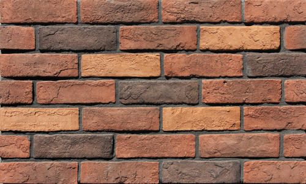
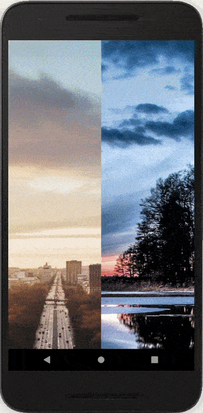

A great way to handle throwing together a whole bunch of images, of varying resolutions, in a real estate restricted place such as a mobile phone is through a masonry component!



We'll go through an interative approach. If you want to skip ahead to the code (which is pretty simple), you can skip ahead to the very end.

## Square bricks
First let's put together our shaky wall with square bricks / images.
 
 I have a bunch of images here that I am going to be using throughout this.

 ```js
 const images = [
  'https://i.pinimg.com/originals/0e/9e/88/0e9e8812f01f82650833264673bf51ed.jpg',
  'https://wallpaperaccess.com/full/7281.jpg',
  'https://free4kwallpapers.com/uploads/originals/2019/07/14/ultra-hd-ocean-s-wallpaper.jpg',
  'https://cdn.wallpapersafari.com/24/3/ZlgUc6.jpg',
  'https://wallpaperplay.com/walls/full/b/5/e/159585.jpg',
  'https://pixelz.cc/wp-content/uploads/2016/11/windows-10-uhd-4k-wallpaper.jpg',
  'https://images-na.ssl-images-amazon.com/images/I/71Tq9OsjO7L._SY879_.jpg',
  'https://c.gitcoin.co/grants/4e0e1e6de351af46fe9482b35840d3bd/logo.png',
  'https://cosmos-production-assets.s3.amazonaws.com/file/spina/photo/6597/180716_fluorescent_P.jpg',
  'https://www.dayglo.com/media/1212/bokeh-3249883_1280.png',
  'https://images-na.ssl-images-amazon.com/images/I/81wajOO6mLL._SX355_.jpg',
  'https://bitesizebio.com/wp-content/uploads/2014/03/dots-and-probes.jpg',
].map((url, id) => ({ id, url }));
```

Let's start out with the render function which is super straightforward, then step into the computation functions where all the magic happens (there's nothing there for rendering square bricks :/). Let's start from what the component returns - it hides the StatusBar, then we render *bricks* from inside a *View* and what's important here is we have a **flexWrap: 'wrap'** style attached to it. So when space runs out in a row, it simply wraps to the next row and continues rendering. Also, **flexDirection: 'row'** makes sure it fills out a row instead of the default direction *column* which would leave out a bunch of empty space since our images only take half the width of the screen.

```js
function App() {
  const [bricks, setBricks] = useState([]);

  const layoutBricks = (images) => {
    const newBricks = [...bricks];
    images.forEach((image) => { newBricks.push(renderItem(image)); });
    setBricks(newBricks);
  }

  const layout = async () => {
    const processedImages = await processImages(images);
    layoutBricks(processedImages);
  }

  useEffect(() => { layout() }, []);

  return (
    <>
      <StatusBar hidden />
      <ScrollView
        style={{ flex: 1 }}
        removeClippedSubviews
      >
        <View style={{ flex: 1, flexDirection: 'row', flexWrap: 'wrap' }}>
          {bricks}
        </View>
      </ScrollView>
    </>
  );
}
```

I have a separate function here inside the *useEffect* called *doLayout*. You cannot have async functions inside an effect so it has to be declared separately for it to work. This has something to do with how the cleanup works (something similar to *componentWillUnmount* for the particular effect).

Now on to the important parts:

A very simplistic renderItem function.
```js
const COL_WIDTH = width * 0.5;

const renderItem = ({ id, url }, ht = COL_WIDTH) => (
  <Image
    source={{ uri: url }}
    style={{ width: ht, height: ht }}
  />
);
```

And the processImage function:
```js
const processImages = async images => {
  const processedImages = [...images];
  for (const i in images) {
    const image = processedImages[i];
    await Image.getSize(image.url, (width, height) => {
      processedImages[i] = { ...image, width, height };
    });
  }
  return processedImages;
}
```

It uses *Image*'s **getSize** method to get the dimensions of the image. This will help us in deciding how our images are going to be laid out later, but for now it doesn't do much.


## Tall bricks
There's actually no idea of columns in the previous approach. Since they are all uniform, you can just wrap them around and it'll automatically get laid out perfectly. Now let's get into building our columns.

Our render function changes significantly. We shall be using the dimensions that we get from the **processImage** function in the previous step.

```js
function App({ columns = 2 }) {
  const [cols, setCols] = useState(Array(columns).fill(columns).map(_ => ({ bricks: [], colHeight: 0 })));

  const layoutBricks = (images) => {
    const newCols = [...cols];

    images.forEach((image) => {
      let ht = image.height;
      let wd = width / columns;
      const currentImage = renderItem(image, ht, wd);

      const heightsArray = newCols.map(({ colHeight }) => colHeight);
      const shortestColumnIndex = heightsArray.findIndex(colHt => colHt === Math.min.apply(Math, heightsArray));
      const shortestColumn = newCols[shortestColumnIndex];

      newCols[shortestColumnIndex] = { bricks: [...shortestColumn.bricks, currentImage], colHeight: shortestColumn.colHeight + ht };
    });

    setCols(newCols);
  }

  const layout = async () => {
    const processedImages = await processImages(images);
    layoutBricks(processedImages);
  }

  useEffect(() => { layout(); }, []);

  return (
    <>
      <StatusBar hidden />
      <ScrollView
        style={{ flex: 1 }}
        removeClippedSubviews
      >
        <View style={{ flex: 1, flexDirection: 'row' }}>
          {cols.map(({ bricks }) => (
            <View>
              {bricks}
            </View>
          ))}
        </View>
      </ScrollView>
    </>
  );
}
```

The function accepts the number of columns it is about to render, with the default being 2. Then we split up the width of the device by the columns and fix the width of the images to this number. The height, however is dynamic and this leads to some pretty interesting images.



Let's start from the top. First of all we create the columns. It simply creates an array of objects where each of the array element represents a column and they have their height set to 0 and the images (**bricks**) set to nothing (an empty array).

```js
const [cols, setCols] = useState(Array(columns).fill(columns).map(_ => ({ bricks: [], colHeight: 0 })));
```

The **layoutBricks** function decides which column it's going to put the current image in. All it has to do is to figure out which column is the shortest and put the image there.

```js
const layoutBricks = (images) => {
    const newCols = [...cols];

    images.forEach((image) => {
      let ht = image.height;
      let wd = width / columns;
      const currentImage = renderItem(image, ht, wd);

      const heightsArray = newCols.map(({ colHeight }) => colHeight);
      const shortestColumnIndex = heightsArray.findIndex(colHt => colHt === Math.min.apply(Math, heightsArray));
      const shortestColumn = newCols[shortestColumnIndex];

      newCols[shortestColumnIndex] = { bricks: [...shortestColumn.bricks, currentImage], colHeight: shortestColumn.colHeight + ht };
    });
```

After dropping an image in the column, it also increases the **colHeight** value appropriately.

Don't forget to take a look at the **renderItem** function which has changed very slightly to also accept height now and the render method now renders columns instead of just doing a row-wrap on all the images.

## Masonry!
Finally for the crescendo we have the complete masonry done.


Going from the previous step to here is actually very very simple. All that's left to be done is to figure out the height of our images. Basically, we force the images to be of a particular width because of our columns restrictions. Similarly the image has to be scaled by the same factor. This is easy peasy to do.

The **layoutBricks** function changes just a little bit to accomodate this change.

```js
const layoutBricks = (images) => {
  const newCols = [...cols];

  images.forEach((image) => {
    let wd = COL_WIDTH;
    const widthReductionFactor = COL_WIDTH / image.width;
    const ht = image.height * widthReductionFactor;
    const currentImage = renderItem(image, ht, wd);

    const heightsArray = newCols.map(({ colHeight }) => colHeight);
    const shortestColumnIndex = heightsArray.findIndex(colHt => colHt === Math.min.apply(Math, heightsArray));
    const shortestColumn = newCols[shortestColumnIndex];

    newCols[shortestColumnIndex] = { bricks: [...shortestColumn.bricks, currentImage], colHeight: shortestColumn.colHeight + ht };
  });

  setCols(newCols);
}
```

We figure out the **widthReductionFactor** and apply it to the **height** as well. Tada! And we're done. This is the complete component with a little bit of margins and spacing.

```js
import React, { useEffect,useState } from 'react';
import {
  Dimensions,
  Image,
  StatusBar,
  ScrollView,
  View,
} from 'react-native';

const { width } = Dimensions.get('window');

const images = [
  'https://i.pinimg.com/originals/0e/9e/88/0e9e8812f01f82650833264673bf51ed.jpg',
  'https://wallpaperaccess.com/full/7281.jpg',
  'https://images-na.ssl-images-amazon.com/images/I/71Tq9OsjO7L._SY879_.jpg',
  'https://free4kwallpapers.com/uploads/originals/2019/07/14/ultra-hd-ocean-s-wallpaper.jpg',
  'https://cdn.wallpapersafari.com/24/3/ZlgUc6.jpg',
  'https://wallpaperplay.com/walls/full/b/5/e/159585.jpg',
  'https://pixelz.cc/wp-content/uploads/2016/11/windows-10-uhd-4k-wallpaper.jpg',
  'https://cosmos-production-assets.s3.amazonaws.com/file/spina/photo/6597/180716_fluorescent_P.jpg',
  'https://c.gitcoin.co/grants/4e0e1e6de351af46fe9482b35840d3bd/logo.png',
  'https://www.dayglo.com/media/1212/bokeh-3249883_1280.png',
  'https://images-na.ssl-images-amazon.com/images/I/81wajOO6mLL._SX355_.jpg',
  'https://bitesizebio.com/wp-content/uploads/2014/03/dots-and-probes.jpg',
].map((url, id) => ({ id, url }));

const processImages = async images => {
  const processedImages = [...images];
  for (const i in images) {
    const image = processedImages[i];
    await Image.getSize(image.url, (width, height) => {
      processedImages[i] = { ...image, width, height };
    });
  }
  return processedImages;
}

const renderItem = ({ url }, ht, wd, imageSpacing) => (
  <Image
    source={{ uri: url }}
    style={{ width: wd, height: ht, marginBottom: imageSpacing }}
    resizeMode="contain"
  />
);

function App({ columns = 2 }) {
  const COLUMN_WIDTH = width / columns;
  const IMAGE_SPACING = COLUMN_WIDTH * 0.01; 
  const COL_WIDTH = COLUMN_WIDTH - (IMAGE_SPACING / 2);

  const [cols, setCols] = useState(Array(columns).fill(columns).map(_ => ({ bricks: [], colHeight: 0 })));

  const layoutBricks = (images) => {
    const newCols = [...cols];

    images.forEach((image) => {
      let wd = COL_WIDTH;
      const widthReductionFactor = COL_WIDTH / image.width;
      const ht = image.height * widthReductionFactor;
      const currentImage = renderItem(image, ht, wd, IMAGE_SPACING);

      const heightsArray = newCols.map(({ colHeight }) => colHeight);
      const shortestColumnIndex = heightsArray.findIndex(colHt => colHt === Math.min.apply(Math, heightsArray));
      const shortestColumn = newCols[shortestColumnIndex];

      newCols[shortestColumnIndex] = { bricks: [...shortestColumn.bricks, currentImage], colHeight: shortestColumn.colHeight + ht };
    });

    setCols(newCols);
  }

  const layout = async () => {
    const processedImages = await processImages(images);
    layoutBricks(processedImages);
  }

  useEffect(() => { layout() }, []);

  return (
    <>
      <StatusBar hidden />
      <ScrollView
        style={{ flex: 1 }}
        removeClippedSubviews
      >
        <View style={{ flex: 1, flexDirection: 'row', justifyContent: 'space-between' }}>
          {cols.map(({ bricks }) => (
            <View>
              {bricks}
            </View>
          ))}
        </View>
      </ScrollView>
    </>
  );
}

export default App;
```

The wide images are obviously not as good as they can be. Watch out the next iteration on the component that handles these in a much better fashion.