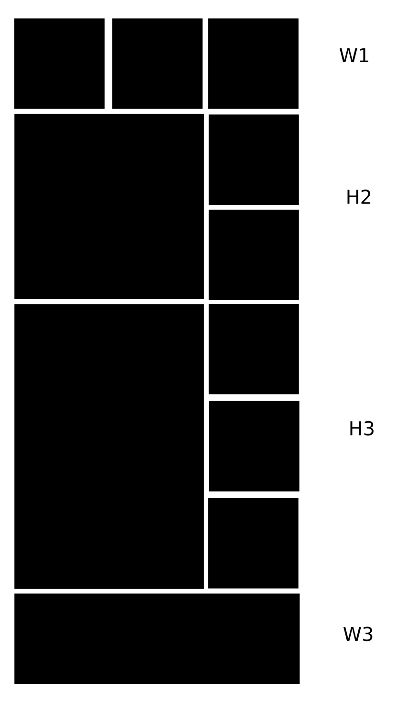
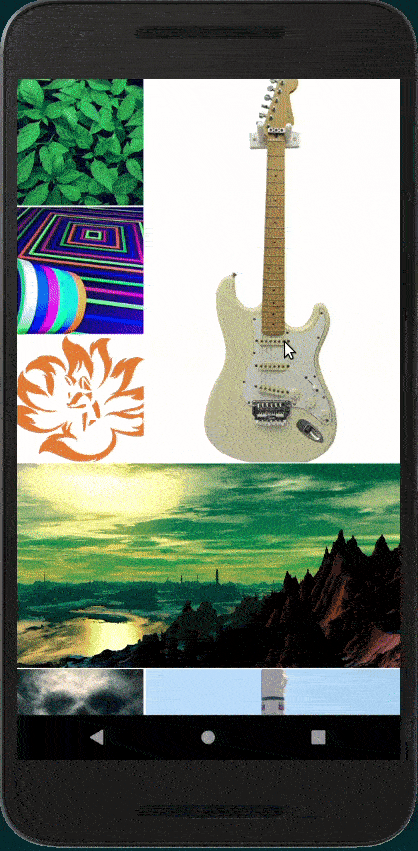

Do check out the column-based masonry layout to start with [here](https://codebrahma.com/writing-a-react-native-image-masonry-component "Column based image masonry component").


This one is going to be a different approach. While the column based approach might look good on a computer which has a wide screen, a row based layout is better for mobile phones which have more height than width. This allows wide images to occupy a row completely while long images can share space in a row. This is what we're talking about:



You can add or remove rows from this layout and based on the device dimension throw in more blocks or whatnot (beyond the scope of the article but it should be easy to extend after you follow along on how to build this). I have classified my rows into 4 - **W1**, **H2**, **H3** and **W3**.

First of all we want to figure out our base block size hereafter referred to as **1 width** or **1W**. I shall be basing it off of my smallest row layout which is going to have 3 1W blocks. 

```js
const COLUMN_WIDTH = width / 3;
const IMAGE_SPACING = COLUMN_WIDTH * 0.01;
const BLOCK_WIDTH = COLUMN_WIDTH - (IMAGE_SPACING / 2); // 1W
```

Since we're splitting the width of the device into three, we'll have three blocks in a row at most and there'll be two bits of spacing between these three blocks. Hence we take the width, split it into 3, figure out the spacing and subtract two of those to get the width (and height of these square blocks) of the primary blocks.

W1 - The first layout consists 3 of 1 Width blocks.

H2 - Taller than the primary block by 2, H2 rows are a single 2W square with 2 1W squares stacked beside it.

H3 - Similar to the H2, but with thrice the height of a 1W and with 3 blocks stacked beside it.

W3 - Simply takes the whole width.

Our previous **processImages** function simply got the height and width and put them in there to create our image data objects. This time around, we need our layout classification as well.

```js
const processImages = async images => {
  const processedImages = [...images];
  for (const i in images) {
    const image = processedImages[i];

    const whRatioScreen = width / height;
    const w3Threshold = whRatioScreen * 3;
    const h2Threshold = whRatioScreen * 2;
    const h3Threshold = whRatioScreen;

    await Image.getSize(image.url, (wd, ht) => {
      const whRatio = wd / ht;

      let dimension = 'W1';
      if (whRatio > w3Threshold) dimension = 'W3';
      else if (whRatio < h3Threshold) dimension = 'H3';
      else if (whRatio < h2Threshold) dimension = 'H2';

      processedImages[i] = { ...image, width: wd, height: ht, dimension };
    });
  }
  return processedImages;
}
```

I get the width : height ratio of the device and use it to figure out the block dimensions. This can be done in other ways. To figure out what works best for you, try playing around with the three threshold values - **w3Threshold**, **h2Threshold** and **h3Threshold**. These can be constants as well.

Our **renderItem** function is pretty much the same as in part 1.

```js
const renderItem = ({ url }, ht, wd, imageSpacing = 0) => (
  <Image
    source={{ uri: url }}
    style={{ width: wd, height: ht, marginBottom: imageSpacing }}
    resizeMode="cover"
  />
);
```

However, the **layoutBricks** functions changes drastically.

## The juice

The old layoutBricks function:
```js
  const layoutBricks = (images) => {
    const newCols = [...cols];

    images.forEach((image) => {
      let wd = COL_WIDTH;
      const widthReductionFactor = COL_WIDTH / image.width;
      const ht = image.height * widthReductionFactor;
      const currentImage = renderItem(image, ht, wd, IMAGE_SPACING);

      const heightsArray = newCols.map(({ colHeight }) => colHeight);
      const shortestColumnIndex = heightsArray.findIndex(colHt => colHt === Math.min.apply(Math, heightsArray));
      const shortestColumn = newCols[shortestColumnIndex];

      newCols[shortestColumnIndex] = { bricks: [...shortestColumn.bricks, currentImage], colHeight: shortestColumn.colHeight + ht };
    });

    setCols(newCols);
  }
```

Since we had two (or more) columns, all it had to do was figure out which coulmn the current image went into. With the row based approach, however we need to fill up a row and then send the row to the render. There's also some math involved in filling our rows according to the layout we have decided upon.

Let's go iteratively about this:

First strip out our column concept and do plain rows.
```js
const [rows, setRows] = useState([]);

const layoutBricks = (images) => {
  const rows = [];

  images.forEach((image) => {
    rows.push(image);
  });

  setRows(rows);
}
```

What I'm going to do next is to collate all my W1 blocks into an array. W1 blocks usually do not decide the layout in  our case; it's the **H2**, **H3** and **W3** blocks that decide it and whatever W1 block is left over goes into the respective gaps to complete the rows.

```js
const { w1Array, blocksArray } = images.reduce((acc, cur) => {
  const out = { ...acc };
  if (cur.dimension === W1) out.w1Array = [...out.w1Array, cur];
  else out.blocksArray = [...out.blocksArray, cur];
  return out;
}, { w1Array: [], blocksArray: [] });
```

Now we let the **blocksArray** decide the layout, fill in the gaps with blocks from **w1Array**. Before we build a row we make sure that we have enough elements from the **w1Array** to complete it. If not, we make these stranded blocks into elements of the **w1Array**.

Alright, let's get working on the blocksArray!

```js
const blockRows = blocksArray.map(image => {
```

I'm going to be breaking up the function to explain it in a more linear fashion.

### W3 row
```js
  if (image.dimension === W3) {
    const widthReductionFactor = width / image.width;
    const ht = image.height * widthReductionFactor;
    return renderItem(image, ht, width);
  }

  const maybeInterchange = Math.random() > 0.5;
```
W3 is the easiest rows of all to fill because it doesn't rely on the existence of primary blocks to complete the row. We just scale the height according the the width scale-down that gets performed to fit it. And then we just render it.

There's one additional line here which does a nifty little thing. It's a boolean called **maybeInterchange** and if you take a look at our **H2** and **H3** layouts, the big blocks can go either on the left or the right. This is controlled by the **maybeInterchange** boolean and it goes either to the left or the right at a 50% rate.

### H2 row
```js
  if (image.dimension === H2) {
    if (w1Array.length >= 2) {
      const w1Element1 = w1Array.pop();
      const w1Element2 = w1Array.pop();
      
      const elements = [
        renderItem(image, COL_WIDTH * 2 + IMAGE_SPACING, COL_WIDTH * 2, IMAGE_SPACING),
        <View style={{ flexDirection: 'column' }}>
          {renderItem(w1Element1, COL_WIDTH, COL_WIDTH, IMAGE_SPACING)}
          {renderItem(w1Element2, COL_WIDTH, COL_WIDTH, IMAGE_SPACING)}
        </View>
      ];

      if (maybeInterchange) elements.reverse();

      return (
        <View style={{ flexDirection: 'row', justifyContent: 'space-between' }}>
          {elements}
        </View>
      );
    } else {
      w1Array.push({ ...image, width: COL_WIDTH, height: COL_WIDTH });
    }
  }
```

First I make sure we have the 2 **1W** blocks that is needed to complete the row. If we don't have two of those I simply relegate the **H2** decider block to a **W1** by turning it into a **1W** block.

Otherwise it's pretty simple. I take the long **H2** block and render it with the appropriate height and with - that is **COL_WIDTH * 2 + IMAGE_SPACING** for height and **COL_WIDTH * 2** for the width.

After that I throw in a *View* with *flexDirection: column* to lay out our **1W** blocks in a tall column beside our **H2** block.

Finally we do the interchage if **maybeInterchange** is true.


### H3 row

The **H3** row is pretty much the same except it accounts for the height with more **IMAGE_SPACING** and the extra **1W** block.

```js
  if (image.dimension === H3) {
    if (w1Array.length >= 3) {
      const w1Element1 = w1Array.pop();
      const w1Element2 = w1Array.pop();
      const w1Element3 = w1Array.pop();

      const elements = [
        renderItem(image, COL_WIDTH * 3 + (IMAGE_SPACING * 2), COL_WIDTH * 2, IMAGE_SPACING),
        <View style={{ flexDirection: 'column' }}>
          {renderItem(w1Element1, COL_WIDTH, COL_WIDTH, IMAGE_SPACING)}
          {renderItem(w1Element2, COL_WIDTH, COL_WIDTH, IMAGE_SPACING)}
          {renderItem(w1Element3, COL_WIDTH, COL_WIDTH, IMAGE_SPACING)}
        </View>
      ];

      if (maybeInterchange) elements.reverse();

      return (
        <View style={{ flexDirection: 'row', justifyContent: 'space-between' }}>
          {elements}
        </View>
      );
    } else {
      w1Array.push({ ...image, width: COL_WIDTH, height: COL_WIDTH });
    }
  }
```

And that's a wrap with our **blocksArray**.

### W1 row

Now that we've worked with and laid out all our decider blocks, the only ones left are the smaller **1W** ones. Simply, put them in a row.

```js
  const w1Rows = (
    <View style={{ flexDirection: 'row', flexWrap: 'wrap' }}>
      {w1Array.map(image => renderItem(image, COL_WIDTH, COL_WIDTH, IMAGE_SPACING))}
    </View>
  )
```

And in the end you set all the rows that were generated into our **rows** array.



## Code

```js
import React, { useEffect,useState } from 'react';
import {
  Dimensions,
  Image,
  StatusBar,
  ScrollView,
  View,
} from 'react-native';

const { height, width } = Dimensions.get('window');

const COLUMN_WIDTH = width / 3;
const IMAGE_SPACING = COLUMN_WIDTH * 0.01;
const BLOCK_WIDTH = COLUMN_WIDTH - (IMAGE_SPACING / 2); // W1

// dimensionConstants
const W3 = 'W3'; // wide
const W1 = 'W1'; // square
const H3 = 'H3'; // 3w lengthwise & 2w
const H2 = 'H2'; // 2w lenghtwise & 2w

const images = [
  'https://i.pinimg.com/originals/0e/9e/88/0e9e8812f01f82650833264673bf51ed.jpg',
  'https://wallpaperaccess.com/full/7281.jpg',
  'https://images-na.ssl-images-amazon.com/images/I/71Tq9OsjO7L._SY879_.jpg',
  'https://free4kwallpapers.com/uploads/originals/2019/07/14/ultra-hd-ocean-s-wallpaper.jpg',
  'https://cdn.wallpapersafari.com/24/3/ZlgUc6.jpg',
  'https://www.dayglo.com/media/1212/bokeh-3249883_1280.png',
  'https://wallpaperplay.com/walls/full/b/5/e/159585.jpg',
  'https://upload.wikimedia.org/wikipedia/commons/e/e0/Long_March_2D_launching_VRSS-1.jpg',
  'https://cosmos-production-assets.s3.amazonaws.com/file/spina/photo/6597/180716_fluorescent_P.jpg',
  'https://c.gitcoin.co/grants/4e0e1e6de351af46fe9482b35840d3bd/logo.png',
  'https://images-na.ssl-images-amazon.com/images/I/81wajOO6mLL._SX355_.jpg',
  'https://www.melbourneairport.com.au/getattachment/Passengers/Parking/long-term-car-park/new-banner-homepage_02.png',
  'https://images.unsplash.com/photo-1490907452017-eccf91f84cf9',
  'https://encrypted-tbn0.gstatic.com/images?q=tbn%3AANd9GcSoI7Yah5HYzaOn2tnpdBGdXgLL5Ka3ElFjYJPM7zZ91_WHw0TO',
  'https://encrypted-tbn0.gstatic.com/images?q=tbn%3AANd9GcQ5UU83l1w0Zd1aZpb2Huo9B0YVzKPbKsCPvL4ZqaZVxXJQYrLi',
].map((url, id) => ({ id, url }));

const processImages = async images => {
  const processedImages = [...images];
  for (const i in images) {
    const image = processedImages[i];

    const whRatioScreen = width / height;
    const w3Threshold = whRatioScreen * 3;
    const h2Threshold = whRatioScreen * 2;
    const h3Threshold = whRatioScreen;

    await Image.getSize(image.url, (wd, ht) => {
      const whRatio = wd / ht;

      let dimension = 'W1';
      if (whRatio > w3Threshold) dimension = 'W3';
      else if (whRatio < h3Threshold) dimension = 'H3';
      else if (whRatio < h2Threshold) dimension = 'H2';

      processedImages[i] = { ...image, width: wd, height: ht, dimension };
    });
  }
  return processedImages;
}

const renderItem = ({ url }, ht, wd, imageSpacing = 0) => (
  <Image
    source={{ uri: url }}
    style={{ width: wd, height: ht, marginBottom: imageSpacing }}
    resizeMode="cover"
  />
);

function App() {
  const [rows, setRows] = useState([]);

  const layoutBricks = (images) => {
    const { w1Array, blocksArray } = images.reduce((acc, cur) => {
      const out = { ...acc };
      if (cur.dimension === W1) out.w1Array = [...out.w1Array, cur];
      else out.blocksArray = [...out.blocksArray, cur];
      return out;
    }, { w1Array: [], blocksArray: [] });

    const blockRows = blocksArray.map(image => {
      if (image.dimension === W3) {
        const widthReductionFactor = width / image.width;
        const ht = image.height * widthReductionFactor;
        return renderItem(image, ht, width);
      }

      const maybeInterchange = Math.random() > 0.5;

      if (image.dimension === H2) {
        if (w1Array.length >= 2) {
          const w1Element1 = w1Array.pop();
          const w1Element2 = w1Array.pop();
          
          const elements = [
            renderItem(image, BLOCK_WIDTH * 2 + IMAGE_SPACING, BLOCK_WIDTH * 2, IMAGE_SPACING),
            <View style={{ flexDirection: 'column' }}>
              {renderItem(w1Element1, BLOCK_WIDTH, BLOCK_WIDTH, IMAGE_SPACING)}
              {renderItem(w1Element2, BLOCK_WIDTH, BLOCK_WIDTH, IMAGE_SPACING)}
            </View>
          ];

          if (maybeInterchange) elements.reverse();

          return (
            <View style={{ flexDirection: 'row', justifyContent: 'space-between' }}>
              {elements}
            </View>
          );
        } else {
          w1Array.push({ ...image, width: BLOCK_WIDTH, height: BLOCK_WIDTH });
        }
      }

      if (image.dimension === H3) {
        if (w1Array.length >= 3) {
          const w1Element1 = w1Array.pop();
          const w1Element2 = w1Array.pop();
          const w1Element3 = w1Array.pop();

          const elements = [
            renderItem(image, BLOCK_WIDTH * 3 + (IMAGE_SPACING * 2), BLOCK_WIDTH * 2, IMAGE_SPACING),
            <View style={{ flexDirection: 'column' }}>
              {renderItem(w1Element1, BLOCK_WIDTH, BLOCK_WIDTH, IMAGE_SPACING)}
              {renderItem(w1Element2, BLOCK_WIDTH, BLOCK_WIDTH, IMAGE_SPACING)}
              {renderItem(w1Element3, BLOCK_WIDTH, BLOCK_WIDTH, IMAGE_SPACING)}
            </View>
          ];

          if (maybeInterchange) elements.reverse();

          return (
            <View style={{ flexDirection: 'row', justifyContent: 'space-between' }}>
              {elements}
            </View>
          );
        } else {
          w1Array.push({ ...image, width: BLOCK_WIDTH, height: BLOCK_WIDTH });
        }
      }
    });

    const w1Rows = (
      <View style={{ flexDirection: 'row', flexWrap: 'wrap' }}>
        {w1Array.map(image => renderItem(image, BLOCK_WIDTH, BLOCK_WIDTH, IMAGE_SPACING))}
      </View>
    )
    
    setRows([...rows, ...blockRows, w1Rows]);
  }

  const layout = async () => {
    const processedImages = await processImages(images);
    layoutBricks(processedImages);
  }

  useEffect(() => { layout() }, []);

  return (
    <>
      <StatusBar hidden />
      <ScrollView
        style={{ flex: 1 }}
        removeClippedSubviews
      >
        {rows}
      </ScrollView>
    </>
  );
}

export default App;
```

This will not work well if pagination or refreshes are involved. In that case what we want to do is to change our **setRows**, **processImages** and other functions that go along with them and make sure they process only the new data. The old **rows** data has to be set and left untouched.
