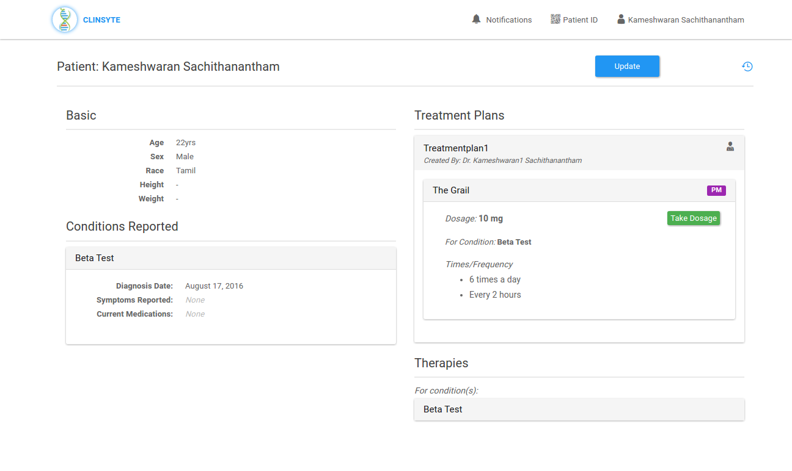
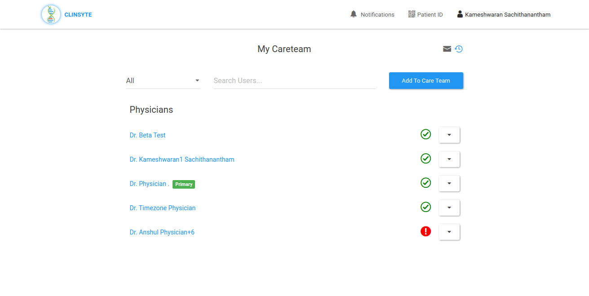
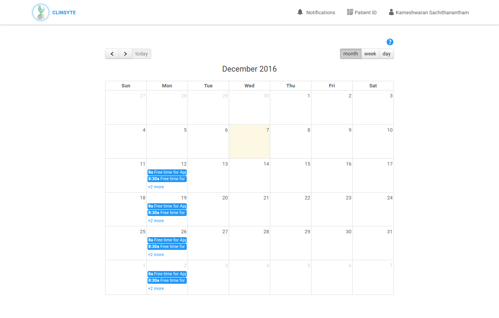
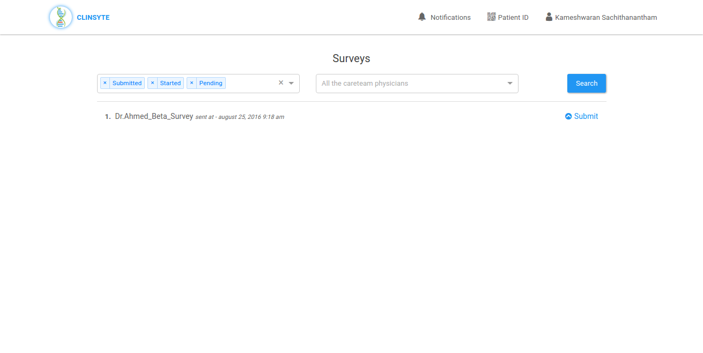

Clinsyte is a platform which connects patients and doctors. Patients can search for doctors, send request to them and vice versa.

Patients can schedule an appointment with doctors. The entire patient data is tracked through the patient chart module in the application.

This application also has surveys which are created by either admin or physician, will be sent to the patients after they take medicine to get their feedback on the therapies. The feedback is considered for data analytics and shows the visual representation of the effect of therapies to the doctors.

## Technologies used:

The backend for Clinsyte was build on Ruby on Rails while the frontend was built on ReactJS. Both the technologies were chosen for their speed of development and quick implementation.

## Appointment Booking

Patients can directly book appointments with their doctor via the app. A robust yet simple calendar based booking system, with an intuitive flow so anybody can book their appointment easily.

## Post Medication Survey

Doctors can run surveys after recommending medications to their patients to gather data about the medications interactions. This is a very valuable feature and can help doctors understand medication and its implications much better.

