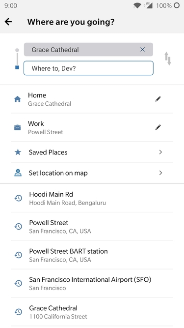
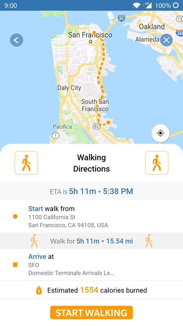

In 2018, Mystro Founder Herb approached Codebrahma for a new product roadmap. They wanted to build an application that helps intracity commuting for people in the best and efficient way.

### Challenges
We build the complete stack which includes backend server, front end apps for both iOS and Android. 
The major challenge in implementing the idea like Bestride is the different types of data format which each of the services like Uber, Lyft and other ride-hailing apps return in their APIs. The app has to handle all the types of data structures without compromising the performance of the app. 

In addition to that, the app should stand out from the giant competitors already in the market which is achieved without any doubts. Taking the careful decision on what computation needs to be on the server and what needs to be done on the client app is very critical for this project. The team has done a tremendous job in architecting the app so that there is a minimal change required to do where ever any of the API providers change their data structure.

### Solution
The mobile application is optimized to the level where even on continuous use of services like geolocation and a significant count of API requests made parallel at any time, the app seems to be responsive, robust and reliable.

### Technologies:
- Node.js for server
- React Native for mobile app (Android and iOS)
