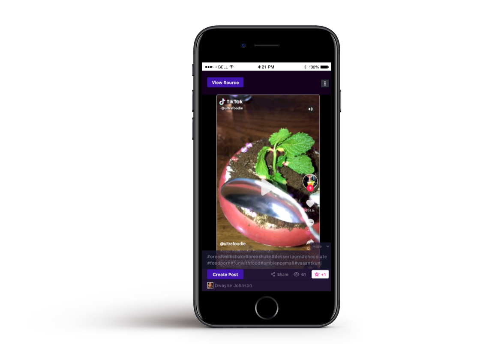
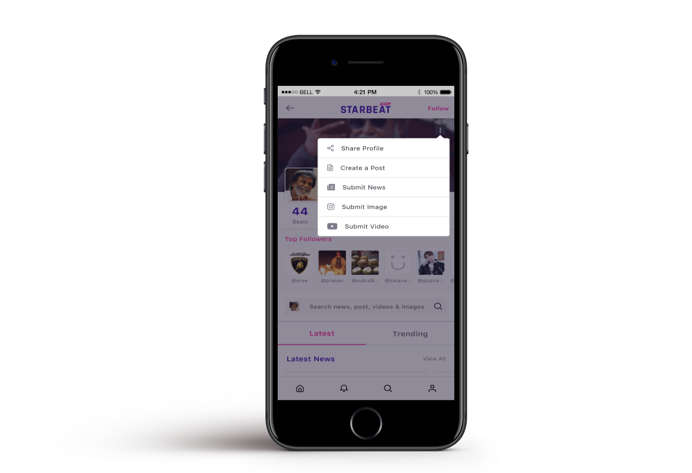

The app was in the entertainment space, focused on stars and fans and all the little interactions surrounding them. The client wanted a mobile application(in React Native) that should be smooth and easy to use. It was a complicated application in terms of UI and navigations and the feature list was long.

## Challenges
Since it was a media-heavy app, we wrote our own component to render images that handled images optimally. Also, it even had a feature that cropped images to focus on people's faces.

Support for several video sources.

Building generalized components that handled all the types but also displayed data in different formats to accommodate carousel, list and card views.

Wrote a wrapper in Kotlin and Objective C to use a Native SDK in the app.

## Tech Stack:

React Native, Native IOS and Android Integration